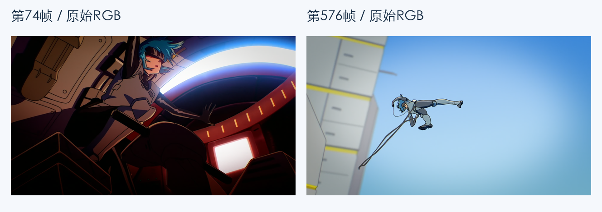
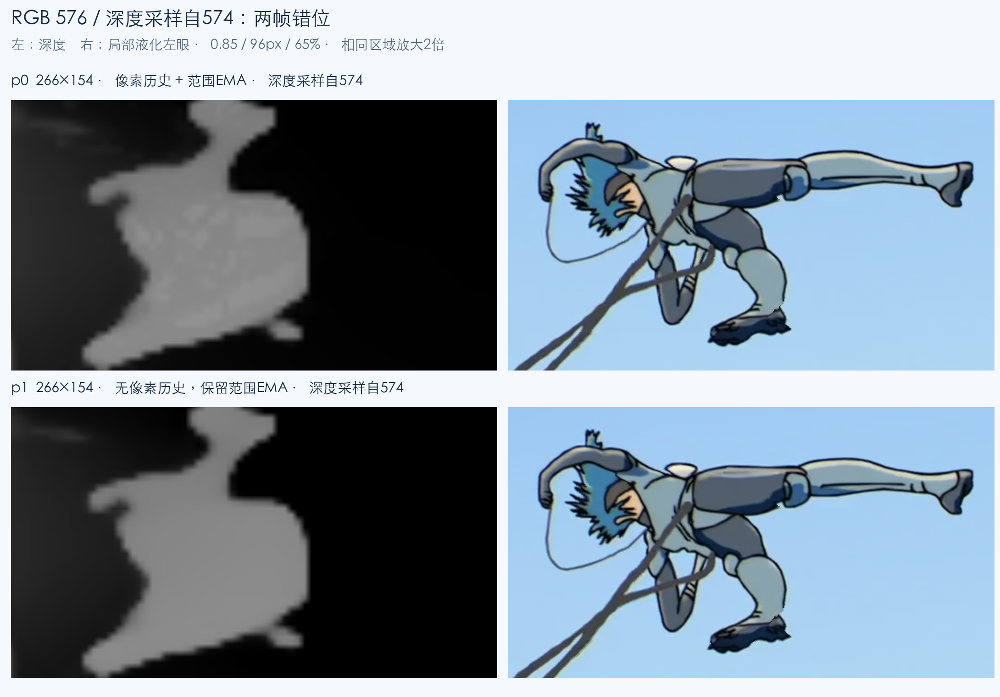
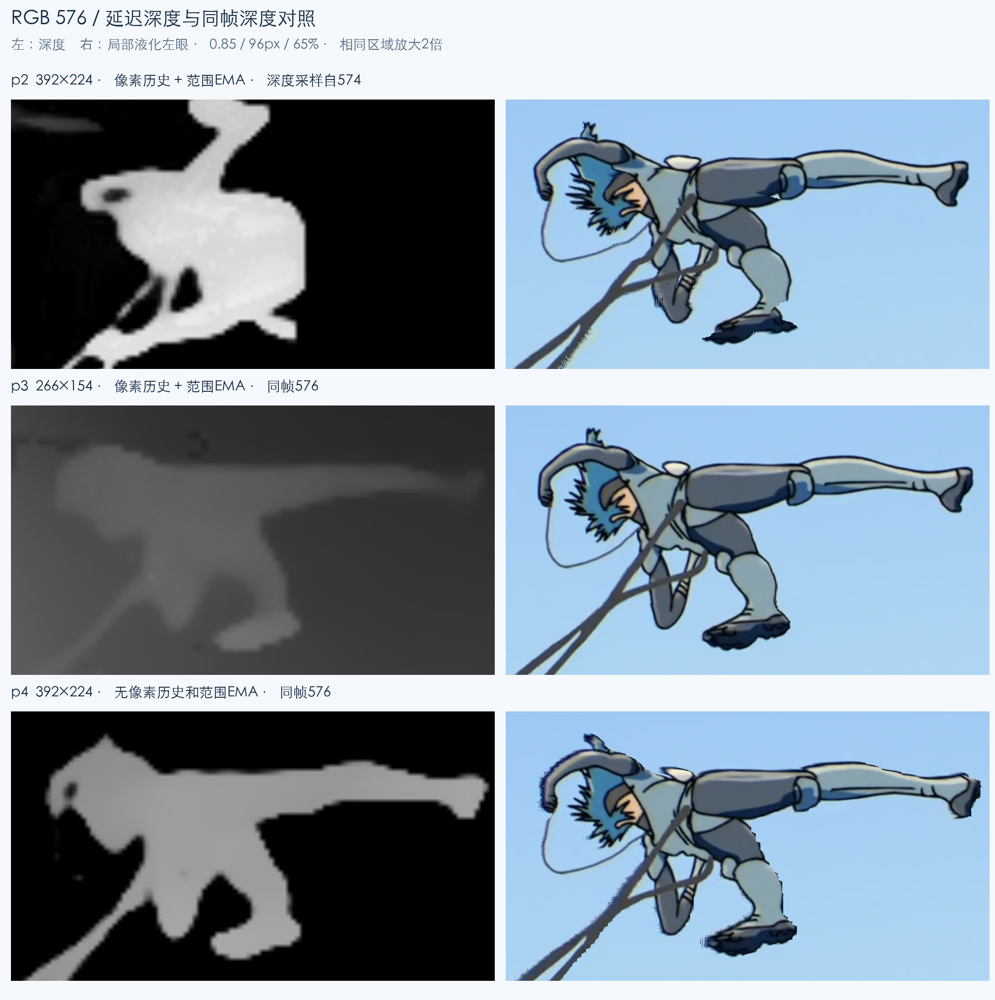
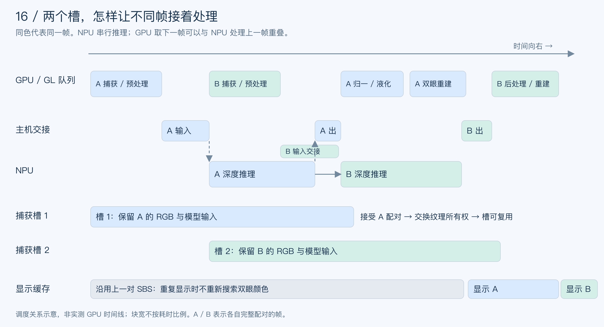
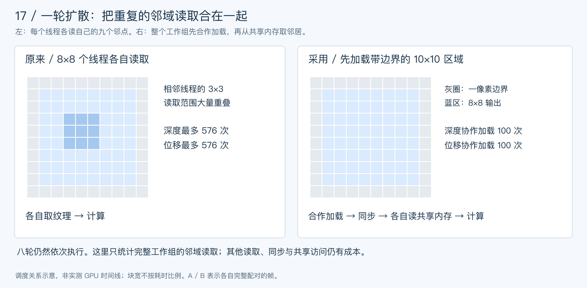
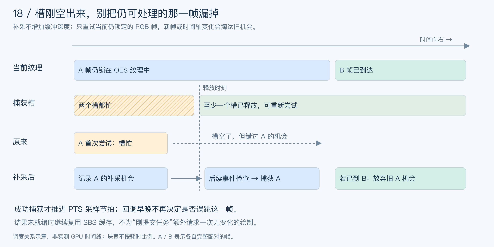
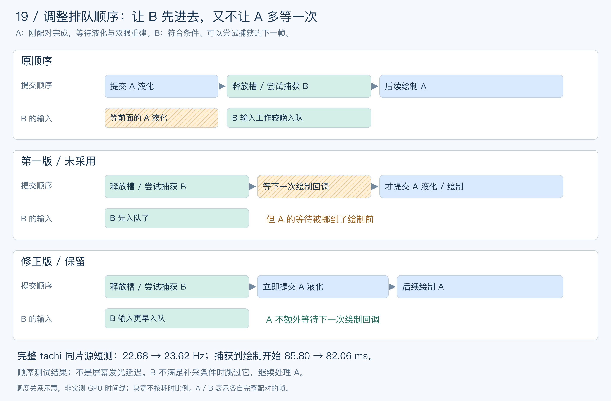

# 手机实时 2D 转 3D 折腾记录——tachi 的 SBS 实现

## 序

最近在和codex折腾雷鸟眼镜的第三方应用开发，astra正好发了，决定让astra挑战一点比较困难的事情，于是就有了这个疯狂的想法：“用手机把普通视频实时转成 3D，再通过雷鸟眼镜播放”。目前项目叫 tachi（塔奇），是一个面向 RayNeo Air 系列眼镜的 Jellyfin 客户端。

项目开源地址：[buggzd/tachi](https://github.com/buggzd/tachi)

基本的播放已经有了，手机连接 Jellyfin、控制播放，眼镜负责显示。接下来想做的是让普通的 2D 视频也能看出立体感，现在已经有很多成熟的软件可以做2d视频转3d了，但是大部分都是离线转换，还需要把转换的视频导到jellyfin里，我觉得很麻烦，所以想做一个实时转换的。

最开始的思路很直接：用模型算一张深度图，再根据深度把原图分别向左右偏移，得到两只眼睛的画面。结果跑起来以后，立体感是有了，人物边缘也开始重影、跳动，背景还会被拉长。后面围绕这些问题试了不少方法，这篇就记录一下具体的实现和踩过的坑。

参考了三个项目：

- [depth-surge-3d](https://github.com/Tok/depth-surge-3d)
- qinglong-vr-3d，up主青龙圣者的自研项目：[青龙圣者的项目介绍](https://www.bilibili.com/video/BV1Svbf6sEvf)，下面会单独介绍它的 Quality 渲染方法。
- [nunif / iw3](https://github.com/nagadomi/nunif/blob/master/iw3/README.md)

这里主要讲深度图算出来以后，怎么和原图一起生成左右眼画面。模型训练和 Jellyfin 客户端的其他功能就不展开了。

## 效果预览


*本地测试页的高动态片段，第 579 帧（19.300 秒）。392 同帧深度，强度 0.85、羽化 96 px、拉伸 65%。左边是左眼，右边是右眼，需要分眼观看才能看到立体效果。*

## 一些基础约定

先说明几个后面会一直用到的词：

- **SBS（Side by Side）**：左右眼画面并排放在一起。我们给眼镜输出的是 3840×1080，每只眼睛分到 1920×1080。
- **深度图**：记录画面各处远近关系的图。下面讲 tachi 时，归一化后的值越大表示越近。
- **视差**：同一个物体在左右眼中的横向位置差，两只眼睛看到的位置不同，就能产生立体感。
- **PTS**：视频帧的媒体时间戳，用来判断 RGB 和深度是不是来自同一帧。

还有一个容易混淆的地方：把同一张视频复制到两只眼睛，再整体平移，可以调节一块平面银幕的远近。tachi 原来的 SBS 虚拟银幕就是这样做的。这不需要深度模型，但视频里的人物和背景还是在同一个平面上。

这里要做的是让人物和背景有不同的视差，所以还需要画面内部的深度。右眼区域比左眼区域多出的 1920 像素，只是并排摆放的位置，算视差时不能把它也算进去。

## 基本思路

深度图一般显示成一张灰度图，看起来像是可以直接叠在视频上。但实际合成时，深度控制的是采样位置。

比如原图里有个人站在墙前面。生成另一只眼睛的画面时，人和墙需要移动不同的距离。只要对每个像素算好位移，就可以得到基础的立体效果。

tachi 最初使用的位移公式是：

```text
单眼位移 = 眼睛方向 × 每眼宽度 × 0.016 × 强度 × (深度 − 0.5)
目标位置 = 原位置 + 单眼位移
```

两只眼睛的方向取相反的符号，深度 0.5 对应这个公式中的零位移位置。0.016 是控制效果幅度的系数，这里用的是相对深度，没有把模型输出标定成真实的米数。

以每眼 1920 像素、强度 0.85 为例，基础位移最大约为单眼 13.06 像素，两眼之间约 26.11 像素。看起来移动得不多，但到人物轮廓上，问题就出来了。


*第 579 帧（19.300 秒），左边是原图，右边是实际 392×224 深度的放大显示。小图里的轮廓精度，会直接影响后面的位移。*

### 为什么会有洞

人移动以后，原来被人挡住的墙应该露出来。但是原图里没有这部分墙，深度模型也只告诉了我们人和墙的远近，没有告诉我们墙上画了什么。


*前景移动后，粉色部分需要新的背景颜色。此图为原理示意。*

这就是补洞问题。与此同时，如果两块内容投影到同一个位置，还要判断谁在前面，不能把背景画到人物脸上。

最理想的状态是能还原出背景，但是这需要借助生成模型的力量，目前手机npu光跑一个深度模型算力就捉襟见肘了。

常见的实现可以分成两种：

1. **前向投影**：遍历原图，算出每个像素应该落到哪里，再把颜色写过去。重叠的位置需要判断遮挡，没人写入的位置会留下洞。
2. **反向采样**：遍历输出图，算出每个位置应该去原图哪里取颜色。这样比较容易让整张图都有颜色，但取错位置依然会有重影和拉伸。

下面几个参考项目的区别，主要就在这个地方。

## 前人的实现

先把三个参考项目和 tachi 的主要做法放在一起，下面再展开具体实现：

| 项目 / 路径 | 深度怎么变成左右眼画面 | 边缘和缺失区域怎么处理 |
| --- | --- | --- |
| depth-surge-3d | 深度换算视差，用 OpenCV `remap` 反向采样原图 | 可选按黑色像素推测空洞，用 Telea / NS 修补 |
| qinglong-vr / Quality | RGB 引导区域归属，再做 16 子像素前向投影 | 判断近景遮挡与覆盖，使用背景代理和 Telea 修补 |
| iw3 / RowFlowV3 | 输入深度、强度和会聚参数，由网络预测横向偏移，再用 `grid_sample` 取原图颜色 | 学习边缘附近的采样位置，仍可能拉伸纹理，不能恢复原图隐藏的内容 |
| tachi / 局部液化 | 同帧深度生成背景位移修正，经过八轮深度引导扩散，再反求原图取色位置 | 优先近景，在背景侧分散拉伸，未覆盖位置用 gather 回退 |

表里的 **Telea 和 NS 都是传统的图像修补算法**，OpenCV 已经提供了实现。给它们一张图，再用掩膜标出哪里需要补，它们就根据周围已有的像素往里面填：

- **Telea**：以提出者 Alexandru Telea 的名字命名，采用快速行进法（Fast Marching）。可以理解成从洞的边缘开始，一层层往里补，根据附近已知像素的距离、方向和颜色变化加权估计新颜色。
- **NS**：是 **Navier–Stokes** 的缩写，借用了流体方程的思路，把洞外的等亮度线方向向洞内延续。直观上，它希望边缘和线条进入缺失区域后还能接着走，而不是只把附近颜色平均一下。

两者都不需要训练模型，也不知道被遮挡的背景实际长什么样。小缝隙可以靠周围颜色接起来，但洞比较大、背景纹理复杂，或者人物颜色也参与了填补，就可能出现模糊、拖色。用在 2D 转 3D 里，它们补的是视觉上的空缺，并不等于恢复了人物背后真实的画面。

### depth-surge-3d

这个项目可以离线把视频转换成 3D，包含视频深度估计、立体生成和输出等步骤。这里看的是它的 `StereoPairGenerator`，生成左右眼时会调用 `depth_to_disparity` 和 `create_shifted_image`。

深度转视差的代码可以简化为：

```python
safe_depth = max(depth, 0.001)
actual_depth = safe_depth * 10.0
disparity = baseline * focal_length / actual_depth
```

这是常见的 `bf/Z` 形式，距离越近，视差越大。不过这里的 `depth * 10` 是一个尺度假设，不能直接理解成模型已经算出了真实距离，换深度模型时也要注意它输出的远近方向。

得到视差后，两只眼睛分别用 `x ± disparity / 2` 构造采样坐标，再交给 OpenCV 的 `remap` 做双线性采样。虽然函数叫 `create_shifted_image`，但看实际代码，它做的是反向取色。[对应源码](https://github.com/Tok/depth-surge-3d/blob/2e65d8e2b981806c7506c9ce3da20f75342cb141/src/depth_surge_3d/utils/imaging/image_processing.py)

后面还有一个可选的补洞步骤。没有传入掩膜时，它把全黑像素当作洞，再把掩膜稍微扩大。fast 使用 Telea，advanced 使用 Navier–Stokes 修补和双边滤波，这些都可以直接调用 OpenCV。

### qinglong-vr-3d

 qinglong-vr-3d 是从 depth-surge 的项目魔改的，不过渲染实现已经不一样了，所以这里单独拿出来讲。

它有 Fast 和 Quality 两种路径。这次主要参考的是 Quality，相比上面的直接采样，它对人物边缘和背景的区分做得更细。

基本流程是：

1. 先在小深度图上划分区域。
2. 用原图颜色帮助确定高分辨率下的区域边界。
3. 在同一侧区域内重新采样深度，避免把前景和背景直接混在一起。
4. 扩张一点前景的覆盖，再做前向投影。
5. 记录哪些位置被覆盖，哪些位置缺少背景，最后修补。

为什么需要前面几步？比如一根很细的头发，在小深度图里可能只占几个像素。直接把深度图放大，头发和背景的深度会混成一条过渡带，合成时这条带就容易变成被拉长的颜色。Quality 会用原图的颜色边缘帮助决定这块区域属于哪一侧。

这里用到了 RGB 测地距离，可以理解为沿着图像传播区域归属时，跨过明显颜色边缘要付出更大的代价。不过衣服花纹和阴影也有颜色边缘，实际效果仍然依赖素材。

投影部分沿水平方向细分成 **16 个子像素覆盖槽**，让覆盖和遮挡判断更细。之后构造背景代理，用 Telea 补全缺失部分，再按覆盖量合成。它能明确区分“这里本来就是黑的”和“这里确实没有投影内容”，比单纯看颜色判断洞更直接。

我们后来把这部分渲染核心单独拿出来，用同一批 392 深度图做了离线对照。没有运行 qinglong 的整套深度估计流程，因此这里比较的是合成方法。[源码快照](https://github.com/buggzd/tachi/blob/90fc2f988a080eb0ba5a87da12ba6b9114a4101a/StereoLab/vendor/qinglong-quality/README.md)、[对照记录](https://github.com/buggzd/tachi/blob/90fc2f988a080eb0ba5a87da12ba6b9114a4101a/docs/performance/2026-09-14-quality-temporal/README.md)

结果并没有因为流程更复杂就直接变好。这轮对照里，完整 Quality 的观看效果仍然不够满意，背景修补和细线附近还是会有问题。原因也容易理解：区域判断可以更准确，但被挡住的墙还是那面没拍到的墙，Telea 只能用周围颜色去估计。

### nunif / iw3

iw3 的方法很多，这里主要看默认的 RowFlowV3。

它的思路比较有意思：深度算出来以后，再用一个模型计算应该怎么扭曲图像。这个模型输入的是深度、立体强度和会聚参数，输出横向采样偏移，最后再用 `grid_sample` 从原图取颜色。

```text
深度 + 强度 + 会聚参数 → RowFlowV3 → 横向采样偏移
原始 RGB + 采样坐标                → 左右眼画面
```

会聚参数可以理解成在调节哪个深度附近的内容不产生视差。默认的偏移预测路径不把 RGB 送进模型，RGB 留到最后采样时使用。[模型源码](https://github.com/nagadomi/nunif/blob/d23721f1b5f0a4c92c3ee1be013180bf298730c5/iw3/models/row_flow_v3.py)、[采样源码](https://github.com/nagadomi/nunif/blob/d23721f1b5f0a4c92c3ee1be013180bf298730c5/iw3/backward_warp.py)

它和简单 `remap` 的区别，是采样坐标由网络预测。根据项目说明，RowFlowV3 使用 `forward_fill` 生成的合成立体数据进行训练，学的是深度边缘附近应该怎样安排取色位置。偏移可以先在较小的图上算，再放大到原图尺寸，颜色仍然从原图采样。

这里的 Flow 不是前后视频帧的光流，`grid_sample` 里的 grid 也不一定是 Unity 那种由三角形组成的 Mesh，而是一张采样坐标表。

这种方法避免了直接逐点前向投影时的空缺，但仍然可能拉伸或重复纹理。它没有生成原图中不存在的背景颜色。

iw3 还提供 `forward_fill`、`forward_inpaint` 和多层反向采样 MLBW 等方法，具体区别可以看它的[方法表](https://github.com/nagadomi/nunif/blob/d23721f1b5f0a4c92c3ee1be013180bf298730c5/iw3/README.md#stereo-generation-method-left-right-image-generation)。我们目前只读了源码，没有把这些模型跑到手机 QNN 上。这条路线留着以后研究，当前 tachi 的液化并不是移植了 RowFlowV3。

## 动手开干

### 第一版：按深度偏移像素

tachi 最早的像素合成用的是 gather33。名字里的 33，就是每个目标像素沿水平方向检查 33 个源候选。

对每个候选，先算它投影后离目标位置有多远。误差小于 0.75 个基准像素时，把它当作可以覆盖这个位置的候选；如果有多个候选，就优先选近景。一个都找不到时，选投影误差最小的那个。

这个方法可以放在 shader 里做，比较容易跑起来，但回退选出的颜色不一定是背景。比如应该露出墙的地方，最后却选到了人物衣服，衣服颜色就会被往外拖。

还有一个问题是跳边。深度只变了一点，候选可能就从这个像素切换成旁边那个，连续播放时轮廓会抖。颜色做双线性采样，也不能保证候选的切换是连续的。

### 提高深度分辨率

轮廓不准确，首先想到的是把模型输入调大。我们试过 266、392、518 等尺寸，这里的尺寸是实际重新固定模型输入并校准的，不是把小深度图放大。

部分片段确实能看出轮廓改善，但不是所有片段都更好。之前一次匿名对照里，有一段仍然是 266 基准更受偏好，而且评分只有 2/5，说明当时整体效果都还有问题。

手机上的成本也很明显：一组测试里，266×154 推理约 18.29 ms，392×224 约 32.68 ms，518×294 约 57.08 ms。想做 24 Hz，每次更新的节拍只有 41.67 ms，518 光推理就已经超过了。

更高的 644×364 在另一轮扫描里约 99.33 ms，770×434 则在创建会话时发生内存分配失败。这是当时模型和部署方式的结果，不代表手机硬件永远只能跑到这个尺寸。[分辨率扫描](https://github.com/buggzd/tachi/blob/90fc2f988a080eb0ba5a87da12ba6b9114a4101a/docs/performance/2026-09-13-resolution-sweep/README.md)

所以最后选了 392×224。分辨率再往上堆，会明显挤占更新率，而重影还不一定能解决。

### 同一帧，换几个深度档位看看

这里用第 74 帧来看深度。这一帧有近处的人物和膝盖、身后的座椅、舱壁，层次比第 579 帧明显。第 576 帧则留着看深度与 RGB 错帧的问题，最后再用 579 走完整条管线。



测试页保留了五个深度档位，差别如下：

| 档位 | 深度尺寸 | 更新与配对 | 历史处理 | 第 74 帧使用的深度 |
| --- | --- | --- | --- | --- |
| p0 | 266×154 | 半帧率，模拟延后 2 帧 | 像素历史融合 + 范围 EMA | 采样自第 72 帧 |
| p1 | 266×154 | 半帧率，模拟延后 2 帧 | 无像素历史，保留范围 EMA | 采样自第 72 帧 |
| p2 | 392×224 | 半帧率，模拟延后 2 帧 | 像素历史融合 + 范围 EMA | 采样自第 72 帧 |
| p3 | 266×154 | 逐帧，同帧 | 仍有像素历史融合和范围 EMA | 第 74 帧 |
| p4 | 392×224 | 逐帧，严格同帧 | 无像素历史和范围 EMA | 第 74 帧 |

素材是 30 fps，所以这里的半帧率是 15 Hz。第 74 帧这一刻，p0–p2 使用的是 72 的深度，错开 2 帧。p3/p4 的逐帧结果都是预计算好的，不表示手机已经能实时跑 30 Hz。


*p0、p1、p2：每行从左到右是深度、gather33、局部液化。这里保留完整画面，方便看前后景层次；深度采用最近邻缩放，颜色画面等比缩小。*


*p3、p4：相同 RGB 和 0.85 强度，液化统一使用 96 px / 65%。*

可以先看左列：膝盖和身体有没有分开，人物和身后舱壁的交界在哪里，弧形结构的深度是否连续。再看右边，同一处经过 gather33 和液化之后，轮廓和背景分别变成了什么样。这样比盯着一张灰度图猜立体效果直观一些。

p0 和 p2 的设置比较接近，可以观察分辨率变化；p0 和 p1 可以看去掉像素历史的影响。但 p2 到 p4 同时改变了配对、更新频率和历史处理，不能只凭两张图就说改善全是高分辨率或同帧带来的。

### 第 576 帧：旧深度用在了当前画面上

这组图更严重的问题是深度和视频没对上。视频以 30 fps 播放，p0–p2 的深度只有半帧率，还模拟了两帧延后。因此 RGB 已经到了第 576 帧，拿来算偏移的深度却采样自第 574 帧，相差约 66.7 ms。



*左列是采样自第 574 帧的深度，右列是用它处理第 576 帧 RGB 得到的液化左眼。p0 有像素历史，p1 已关闭像素历史，但两者都存在相同的两帧错位；关闭历史并没有让深度与 RGB 对齐。*

看人物的姿态就容易理解：深度图里的手臂和腿还在旧位置，当前 RGB 里的人已经动了。算法是在相同坐标取深度，不会自动寻找人物的新位置。于是当前属于人物的像素，可能取到旧深度里的天空，被当作背景往另一个方向移动；旧位置上的背景，又可能按人物深度发生偏移。一个身体被错分成几块，重建后就会出现拉扯、断层和轮廓错接。

所以帧率的同步是非常重要的。



*p2 同样使用采样自 574 的深度；p3、p4 使用第 576 帧对应的深度。p3 仍含历史融合，p4 不含历史；分辨率等设置也有不同，因此这不是只改变配对时间的单变量实验。*

这里说的“帧率没对上”，最终落到实现上是帧的对应关系没对上。深度更新率低于视频时，如果一直拿最近算完的旧深度处理正在播放的新 RGB，就会发生这种情况。即使两边帧率相同，固定晚两帧也一样会错位。需要保证的是它们来自同一帧，而不只是两个 FPS 数字相等。

### 历史融合是另一个问题

深度图会抖，很自然会想到把前后两次深度混合一下。但物体移动后，同一个屏幕坐标可能已经从人物变成背景，直接混合仍可能留下旧轮廓。这和上面的错帧不同：一个是深度本身混入了历史，一个是把某帧的深度用到了另一帧 RGB 上。

我们试过历史融合、范围 EMA、历史裁剪和不同门限，也试过用光流把旧深度往新位置搬。桌面合成测试里，带可信度检查的 DIS 光流传播让移动轮廓误差下降了约 63%，但新露出的区域还是难处理，而且要额外获取运动输入、判断遮挡，手机上的成本也没有验证完。[桌面实验](https://github.com/buggzd/tachi/blob/90fc2f988a080eb0ba5a87da12ba6b9114a4101a/docs/performance/2026-09-11-desktop-optimization/README.md)

历史处理的效果需要在 RGB 与深度先配对正确的前提下比较，不能拿上面两帧错位的截图证明它导致了断层。

### RGB 和深度必须对上

上面的问题来自模型算深度需要时间，但视频还在继续播放。

假设拿第 0 帧去算深度，结果回来时已经播到第 2 帧。如果直接把这个深度用在第 2 帧上，人物的位置就对不上了。继续调补洞参数，也修不好这个时间差。


*图中用晚两帧到达举例，实际延迟会变化。*

现在的做法是，取模型输入时把对应的全尺寸 RGB 一起保存下来，等深度处理完了，再把这一对 RGB 和深度交给渲染器。没算完就先显示上一对。

这样至少可以保证人物和自己的深度轮廓是对齐的。代价是画面会晚一些，忙的时候也会重复帧，不能再用“深度和 RGB 的时间差为 0”来说明整个播放没有延迟。

当前还去掉了像素历史融合和范围 EMA，深度范围每帧用 P2/P98 重新映射。P2/P98 就是取第 2 和第 98 百分位作为两端，减少极端值的影响：

```text
d = clamp((raw − P2) / (P98 − P2), 0, 1)
```

上面省略了退化范围的检查。逐帧处理让它跟随当前画面，但模型本身的抖动和尺度变化依然存在。

### 补洞和网格也试了一圈

除了前面提到的完整 Quality，还试过透视网格、断边网格、全局弹性网格和前后帧补背景。

网格很好理解：按深度把顶点放到不同距离，再从两个相机看过去。但人物和墙之间如果还连着三角形，这个三角形就变成一张斜面，把纹理拉过去。把跨度大的三角形删掉，斜面消失了，洞也露出来了。


*第 579 帧，左边原图，右边断边网格。使用相同坐标裁切并放大，紫色是测试页显示的未覆盖区域。头部、手臂和腿部附近都能看到缺口；断边阈值为 0.08。*

全局弹性网格则尽量保证每一行都连续覆盖，不出现折叠和缺口。结果是覆盖有了，形变也扩散到了更多地方，人物会有胖瘦变化，背景会弯，还会影响原来的会聚位置。

前后帧补背景听起来更合理：这帧被人挡住的墙，前几帧或者后几帧可能露出来过。我们取过前后 1、3 帧，用 DIS 匹配可见背景，再用 RANSAC 仿射模型推算背景的位置，符合条件才拿来补。

它确实能使用视频里真实出现过的颜色，但遇到复杂运动、重复纹理或深度错位，还是容易匹配错。三个片段的缺失覆盖中，使用了前后帧颜色的比例约为 26%、64%、68%，这个数只表示用了多少，不能表示补对了多少。

而且 24 fps 视频等未来 3 帧，就已经要多等约 125 ms，还没开始算补洞。离线转换可以慢慢处理，实时播放还得一起考虑音频和字幕，所以这条路线暂时没有放到手机里。[时序补洞记录](https://github.com/buggzd/tachi/blob/90fc2f988a080eb0ba5a87da12ba6b9114a4101a/docs/performance/2026-09-14-quality-temporal/README.md)

另外也试过 Guided filter、联合双边细化和少次迭代逆投影。前两种在桌面测试里没有得到足够好的边界效果；逆投影在平滑区域很快，但薄线和深度断层容易采错表面。这些实验都保留了，没有作为当前默认方法。[其他实验记录](https://github.com/buggzd/tachi/blob/90fc2f988a080eb0ba5a87da12ba6b9114a4101a/docs/archive/2026-09-14-sbs-route-survey.md)

## 现在的做法：背景局部液化

试到这里，最后留下的是严格同帧配合背景局部液化。这组效果在本轮对照里比较满意，所以从 v0.4.0 开始作为 Full 版的默认配置。

灵感是来自实时美颜软件，液化背景。在观众视线焦点锁定在前景的时候，背景的液化变形是较为可接受的。

基本思路是：原来的前后景位移保留，在需要露出背景的一侧，把附近背景稍微拉过去，再用一段羽化范围分散形变。这样不需要在洞里重新猜一团颜色，也尽量不去拉扯整个画面。


*第 579 帧，同坐标裁切并用最近邻放大。左上原图，右上 gather33，左下全局弹性网格，右下局部液化。三个合成方案共用 p4 同帧深度和 0.85 强度，液化使用 96 px / 65%，弹性网格为 193 列。*

这里可以对着头部、手臂和腿部看取色后的轮廓。液化结果也仍有细碎边缘，但是视频中拖尾效果要好很多。

### 管线整体流程


*按编号看：上排从左到右是原图、深度和背景修正；下排是取色诊断、左眼结果和 SBS。它们来自同一帧，诊断颜色不会出现在最终画面里。*

第一步先保留第 579 帧原图。第二步取得它对应的 392×224 深度，并用 P2/P98 映射范围。这里展示的是测试页实际使用的归一化深度。

第三张橙色图是算法实际算出的**左眼背景额外位移**，已经经过八轮扩散。黑色表示没有额外修正，越橙表示修正越多，固定色标为 0–12 个源图像素；这张图的最大值约为 10.56 px。它只表示加在基础视差之外的那部分，黑色区域仍然可能有原本的立体位移。

接下来，重建 shader 根据位移场找回原图中的颜色。第四张是测试页自带的诊断：绿色标出额外拉伸，紫色表示仍需原始填充回退的位置。

关闭诊断，就得到第五张正常左眼画面。右眼使用另一个方向的位移场单独重建，两张画面并排后得到第六张 SBS。

这张流程图能直接看出，液化改的是中间的位移，而不是把原图先涂成绿色，或者把深度图叠在原图上。下面再展开位移是怎么算的。

### 1. 找到需要修正的背景

在深度小图上，两只眼睛向相反方向搜索。如果附近出现更近的深度，就根据深度差和距离，计算当前背景需要多少修正。

深度差的连续门控范围是 0.025–0.12，距离权重在 96 个每眼源图基准像素内逐渐衰减。用连续权重，是为了避免刚跨过某个门限就突然换一种效果。

### 2. 把修正连接起来

如果每一行各算各的，行与行之间可能对不上，图片边缘会存在毛刺。这里对修正场做八轮二维深度引导扩散，让相近深度的邻居互相影响，跨明显深度边缘时减少传播。

这里扩散的是位移，不是把视频颜色模糊八遍。实现放在 GLES 3.1 compute shader 中，复用三张低分辨率 RGBA32F 纹理，不需要 CPU 按像素循环处理。

最后的位移可以简化成：

```text
单眼位移 = 方向 × 每眼宽度 × 0.016 × 0.85
         × [(深度 − 0.5) + 0.65 × 当前眼的背景修正]
```

现在固定的三个参数是：

- **强度 0.85**：控制基础位移幅度。
- **羽化 96 px**：控制修正影响的范围，按每眼 1920 源宽换算。
- **拉伸 65%**：背景修正的权重，不是把整张背景放大 65%。

对应源码：[field.comp](https://github.com/buggzd/tachi/blob/90fc2f988a080eb0ba5a87da12ba6b9114a4101a/AndroidApp/native-video/src/main/assets/gpu-liquid/field.comp)

### 3. 重新采样画面

还有一个细节：一个源像素被拉长以后，可能覆盖多个目标像素。如果仍然只检查离散采样点，中间会再次留下缝隙。

所以现在会检查相邻源点投影后形成的连续区间，在区间里反求取色位置；多个表面重叠时仍然优先选近景。实在没有找到覆盖的位置，就保留原来的 gather 回退。

对应源码：[render.frag](https://github.com/buggzd/tachi/blob/90fc2f988a080eb0ba5a87da12ba6b9114a4101a/AndroidApp/native-video/src/main/assets/gpu-liquid/render.frag)

液化也有缺点。背景纹理会被拉长，直线可能弯曲，严重时有果冻感。深度模型漏掉的发丝也不会因为液化就重新出现。只是对目前这些素材来说，局部背景变形比前面一些错误补色和全局拉扯更容易接受。

## 手机端实战

算法在电脑上能出图，和手机一边解码一边稳定播放，差别还是很大。当前手机上的整体流程如下：


*解码、模型推理和合成分别进行，RGB 快照跟着对应的深度一起交接。*

### 解码和模型推理

早期试过 HTML video、Canvas / WebGL 取帧，再跨桥去推理。这种方法搭原型方便，但读回像素和跨桥调度都要花时间，底层的帧和缓冲也不好控制。

后来把播放搬到 Android 原生，Media3 / MediaCodec 负责硬解码，视频输出到 OES 纹理，GPU 再生成模型需要的小图、转换 CHW 排列并做标准化。WebView 留下目录、控件和字幕，不再负责解码视频。

深度模型用的是 Depth Anything V2 Small，输入 392×224，量化配置是 U16 activations / I8 weights，通过 ORT QNN 调用 HTP。简单理解就是 NPU 算深度，GPU 处理图像和合成，CPU 负责把流程串起来。

目前实测的是 SM8850 / V81，其他手机还需要单独验证。具体构建方法放在[实时 SBS 文档](https://github.com/buggzd/tachi/blob/90fc2f988a080eb0ba5a87da12ba6b9114a4101a/docs/REALTIME_SBS.md)里，本文不再重复依赖和打包步骤。

### 先把网页里的 CPU 液化搬到 GPU

网页测试时，局部液化的位移场还是在 CPU 上算的。暂停、换参数、看效果，这样很方便；放进手机播放器以后，就不能每次都在 CPU 上遍历深度图，再把整张位移场传回 GPU 了。

原生版把背景修正和八轮二维扩散都搬进了 GLES compute，左右眼一起计算。保留 392 深度、0.85 强度、96 px 羽化和 65% 拉伸，先确认移植没有改变已经看好的效果，再谈提速。桌面对照里，包括高动态第 579 帧在内，位移误差低于 0.00001 个像素。这只是同输入下的算法数值验证，手机的 QNN 量化深度和网页 float 深度仍有差别。[移植记录](https://github.com/buggzd/tachi/blob/90fc2f988a080eb0ba5a87da12ba6b9114a4101a/docs/performance/2026-09-14-native-liquid/README.md)

全尺寸 RGB 也尽量少搬一次。新配对接受后，交换捕获纹理和显示纹理的所有权，而不是再复制一张 1080p 图。这个地方省的是已有纹理之间的复制，最开始保留同帧 RGB 快照的工作还是要做。

### 双缓冲和缓存

NPU 这边串行推理，但下一次取帧可以和其他阶段重叠。这里用了两个捕获槽，每个槽保存自己的模型输入和全尺寸 RGB，在结果被接受或者丢弃之前不能随便覆盖。

为什么不多开几个？因为视频不是离线任务，积压越多，最终显示的画面就越旧。现在槽忙就跳过采样，显示上一对已经处理好的结果。

重复显示时，也不用重新做完整的双眼搜索，直接复用已经合成好的 SBS FBO。两张 1920×1080 RGBA8 的眼图约占 15.8 MiB，能省掉重复合成的工作。

快进、换视频或 Surface 重建时，这些缓存还需要一起失效，不然异步结果晚到，就可能把跳转前的旧画面重新画出来。

### 先弄清楚帧是在哪里漏掉的

一开始看到 NPU 推理大约 32 ms，很容易想：24 fps 每帧有 41.67 ms，应该够了吧？实际却没这么简单。取帧、GPU 排队、完成通知和缓冲槽周转也会影响下一帧什么时候能进去。流水线可以重叠执行，所以不能把所有阶段耗时直接相加，也不能只拿模型耗时推算最终帧率。

为此先加了一组采样计数：是还没到采样时间，还是 GPU 读回没完成，还是两个槽都没空？再分开统计新生成的配对画面和重复显示的缓存。这样才能知道下一步该改哪里，而不是一看到帧率低就换小模型。

后面这几轮都保留原来的分辨率、八轮扩散和液化参数，主要找重复计算和等待。

先把两帧放到同一条时间轴上：蓝色是 A，绿色是 B。从左向右看，A 进入 NPU 后，GPU 可以准备 B；但 NPU 仍然一次只处理一帧。下面两条长色带表示捕获槽要保留这帧的数据多久，底部则是眼镜正在使用的 SBS 缓存。



沿着这张图找优化位置：入口用 PTS 避免误跳帧，槽位释放时争取补采，GPU 扩散减少重复读取，显示端复用已经合成的 SBS。色块宽度只是示意，不是实测耗时；输入和输出之间的主机交接也还没有消除。


### GPU 的邻居数据，大家一起读

八轮扩散里，每个像素都要看周围 3×3 的深度和位移。相邻像素看的区域大量重叠，原来每个线程各读一遍，会产生很多重复纹理读取。

改法是让 8×8 的线程工作组，合作把包含一圈边界的 10×10 数据先放进 GPU 工作组共享内存，再各自读取邻居。对于一个完整工作组，每轮邻域部分原本最多各读 576 次深度和位移，现在各协作加载 100 次；中心深度和其他读取仍然存在，也多了同步开销，不能据此说速度会提高五倍。

这里的“共享内存”只在 GPU 工作组内部，和后面 GPU、NPU 之间的共享缓冲不是一个东西。

把 GPU 液化中的**一轮扩散**放大，就是下面这个变化。八轮仍然依次执行，没有减少轮数，也没有把所有轮次同时算。



前后计算的邻域相同，变化的是数据从哪里读。后面尝试的“两轮扩散融合”则是在这个基础上继续减少 GPU 调用次数，两项优化不要混在一起。


### 按视频时间采样，槽空了再补一次

另一个问题藏在采样节拍里。片源是 23.976 fps，目标采样是 24 Hz，看上去应该每帧都能选到。但如果按线程收到回调的墙钟时间判断，回调稍早一点，就可能被认为“还没到时间”，白白跳过一帧。

于是严格同帧路径改为按视频帧的 PTS 选帧，PTS 就是这一帧在视频时间轴上的位置。真实计算耗时仍用单调时钟测量，快进、换源时重置采样节拍。这一步让那轮测试中因节拍造成的误跳帧降到了 0。

再往下看，有时一帧到达时两个槽都忙，过一会儿槽空了，却已经没有机会处理它。我们给这种情况留了一次补采机会：只有原来的帧还锁在纹理里、没有新帧等待、时间轴也没变，才允许重试。新帧到了就放弃旧机会，不增加第三个槽。

最后还去掉了一次无用的重绘请求：刚把深度任务交出去，结果还没回来，画面其实没有变化，这时不必主动再请求画一次缓存。正常的视频、界面更新和新配对仍然会触发绘制。

再把“当前视频帧”和“槽位是否空闲”放到同一条时间轴上。A 到达时没有槽，不代表 A 被替换之前一直都没有槽；中间这段空出来的机会，就是补采要抓住的。



图中的补采检查由后续绘制或 GPU 完成交接触发，不会原地忙等。新配对没回来时，眼镜仍可显示已有缓存；取消的是一次多余的主动绘制请求。


这一串改动在同一本地片源、手机测试入口里得到下面的结果：

| 当轮版本 | 新配对更新率 |
| --- | ---: |
| 诊断基线 | 16.34 Hz |
| 加 GPU 邻域共享 | 19.96 Hz |
| 再加 PTS 采样 | 21.21 Hz |
| 再加同帧补采 | 23.12 Hz |
| 再去掉额外重绘 | 23.48 Hz |

这是手机上的独立测试入口，每眼仍按 1920×1080 合成，取同一媒体区间做顺序短测。它没有完整 Jellyfin 播放、字幕和外接眼镜的负载，不能拿这个 16.34 直接和后面的完整 tachi 数据算提升比例。温度和频率也没有固定，这张表记录的是当轮观察到的改善，不是长期帧率保证。[采样与共享邻域优化记录](https://github.com/buggzd/tachi/blob/90fc2f988a080eb0ba5a87da12ba6b9114a4101a/docs/performance/2026-09-15-liquid-24hz/README.md)

而且中途“只加补采”的版本，更新率提高了，软件视频落后均值却从约 76.9 ms 增到了 81.8 ms。去掉额外重绘后才降到约 70.3 ms。这也是为什么后面不再只盯着 FPS。

### 换个线程，不一定就快了

我们也怀疑过 GPU 完成通知绕了一次主线程，会不会在这里等太久，于是把轮询定时器移到独立线程试了一轮。真正的 GLES 操作仍在原 GL 线程执行。

这次用完整 tachi、同一 Jellyfin 片源和外接眼镜，按“原调度 → 独立线程 → 回切原调度”测了三轮，每轮约三分钟：**22.77 → 23.37 → 22.98 Hz**。

如果只看前两轮，会觉得有 2.6% 的提升；回切后发现，原版自己也变快了。独立线程相对回切只剩约 1.7% 的优势，加上温度和启动状态不同，还不足以确认稳定收益，所以没有默认开启。[轮询对照记录](https://github.com/buggzd/tachi/blob/90fc2f988a080eb0ba5a87da12ba6b9114a4101a/docs/performance/2026-09-15-gpu-poll-short/README.md)

### 算得快，还要排得对

真正留下来的一项优化，是调整捕获和液化的先后顺序。

原来接受一对 RGB 和深度后，先提交当前帧的液化，再释放槽、尝试捕获下一帧。下一帧的输入就可能排在上一帧液化后面。改成先释放槽并尝试补采，再立即提交当前帧液化，就给下一次模型输入早点完成的机会。

中间还走了一次弯路：第一版把液化完全推迟到下一次绘制。捕获到上传降到了约 79.56 ms，但捕获到绘制开始仍约 86.46 ms。前面的指标好看了，等待却被搬到了后面。后来改为补采后立即提交液化，不再专门等绘制回调，才得到更有用的改善。

最后把“释放槽、捕获下一帧”和“当前帧液化”这一段单独展开。A 是刚配对完成的画面，B 是下一张符合补采条件的画面；橙色斜纹标出了等待发生在哪里：



这是命令提交顺序示意，方框宽度不代表耗时。B 不满足补采条件时会跳过捕获，仍继续处理 A；A、B 始终各用自己的 RGB 和深度。收益来自给下一帧输入更早完成的机会，而不是把两帧混起来或者多开缓冲槽。


完整 tachi、同一 H.264/AAC HLS 与 ASS 字幕片段，三轮共同有效区间的结果是：

| 指标 | 原顺序 | 补采后立即液化 |
| --- | ---: | ---: |
| 新配对更新率 | 22.68 Hz | 23.62 Hz |
| 捕获到绘制开始 | 85.80 ms | 82.06 ms |
| 软件视频与配对 PTS 差均值 | 92.49 ms | 81.94 ms |

这轮约增加了 4.1% 的新配对吞吐，软件延迟指标也改善了，所以保留了这个顺序。不过“绘制开始”还没有包含 GPU 绘制完成和屏幕发光；阶段耗时取自滚动均值的采样统计，也不能当成逐帧端到端延迟。[排队优化记录](https://github.com/buggzd/tachi/blob/90fc2f988a080eb0ba5a87da12ba6b9114a4101a/docs/performance/2026-09-15-capture-order/README.md)

### 少调几次 GPU、少读几次纹理，结果却没有提帧

后面又试了两项看起来很有希望的 shader 优化。

第一项是把两轮扩散放到一次 GPU 调用里。当前每轮已经同时读取横纵 3×3 邻域，并不是先横着算完整张图，再竖着算一遍。真正串行的是八轮迭代，因为后一轮依赖前一轮。融合以后仍然算满八轮，只是工作组多加载一圈边界，在内部连续做两轮，把含初始场生成的调用次数从 9 次降到 5 次。

第二项是复用最终重建的采样。搜索连续线段时，前一段的终点可能就是下一段的起点，那它的深度和位移没必要重新读。先试过两行数组缓存，后来又改成更轻的相邻端点复用，只有坐标完全相同时才沿用。

先在手机 GLES 上做数值对照，覆盖奇数尺寸、图像边缘、断行、噪声和高动态 579 帧深度等输入。候选在这些测试里没有产生位移场或 RGBA8 输出差异，然后再用完整 tachi 测性能：

| 方案 | 新配对更新率 | 捕获到绘制开始 |
| --- | ---: | ---: |
| 原方案 | 23.74 Hz | 80.96 ms |
| 两轮扩散融合 | 23.61 Hz | 82.20 ms |
| 相邻端点采样复用 | 23.53 Hz | 81.74 ms |

没有得到预期的提帧。采样复用的 GPU 渲染计时小幅下降了约 3.3%，但整条管线没有跟着变快。融合要付出更宽边界的数据加载和重复计算，缓存也要占寄存器、增加判断，少几次纹理指令或者调用，并不等于总耗时一定更低。

所以这两项都保留为实验开关，默认关闭。和前面的邻域共享不同，它们还没有足够的整机收益支持。这几轮也是顺序短测，不能反过来断言候选在所有情况下都更慢。[shader 对照记录](https://github.com/buggzd/tachi/blob/90fc2f988a080eb0ba5a87da12ba6b9114a4101a/docs/performance/2026-09-16-liquid-shaders/README.md)

### 目前还不是零拷贝

GPU 做了预处理，不代表数据就能直接进 NPU。现在 ORT QNN 的产品路径仍有主机输入和输出交接。

轮询对照里，主机读回的 map/copy 只有约 0.14–0.17 ms，所以不能想当然地认为去掉一次拷贝就能省下好几毫秒。更值得研究的是它连带的同步和排队等待。

完整模型的共享缓冲已经做过独立测试，用 AHardwareBuffer 同时给 GPU 和 QNN 使用。但那还没有包含完整播放器的预处理、液化和呈现，同步里也还有 `glFinish`，目前没有接进正式播放路径。[共享缓冲实验](https://github.com/buggzd/tachi/blob/90fc2f988a080eb0ba5a87da12ba6b9114a4101a/docs/performance/2026-09-13-daily-sbs/README.md#完整模型共享缓冲)

## 实际效果和还没解决的问题

### 单帧深度画面抖动

现在还有一个比较明显的问题：深度估算仍然是单帧进行的。模型每次只看当前这一张图，不知道上一帧估算出了什么。前后两帧即使肉眼看起来几乎一样，细微的画面变化也可能让它给出不同的深度，物体的层次、边缘或整体深度范围都可能发生波动。

深度一变，左右眼的位移就跟着变。原本没怎么动的物体，转成立体画面以后反而会有抖动，有时会感觉表面在轻微起伏。严格同帧只能保证 RGB 和深度属于同一张画面，不能保证前后两张深度图彼此稳定。前面去掉历史融合，避开了旧深度造成的拖尾和断层，也把单帧估算本身的波动直接暴露了出来。

更理想的处理方向是改用包含时序的视频深度模型，让模型结合连续画面和运动关系来估算深度，在估算阶段就考虑前后帧的一致性。这和算完之后简单混合两张深度图不是一回事，也更有希望同时处理稳定性和运动时的轮廓变化。

不过手机上还得同时解码、合成立体画面和显示，当前单帧模型的耗时已经不低。视频模型还要考虑额外的计算、时序状态或多帧缓存，以及端侧部署和延迟，受这些限制，目前暂时没有实现。这是后续最想改善的画质问题之一，现阶段还不能说抖动已经解决。

### 持续播放的表现

一次完整 tachi 的 Jellyfin 播放测试，使用 SM8850/V81 和 RayNeo Air 3s，HEVC 视频、WebVTT 字幕，在充电环境下连续有效运行了 **21 分 24.6 秒**，平均 **22.54 Hz** 新配对更新。

## 尾声

至此，手机边播边做 2D 转 3D 已经能跑起来了。目前用的是 392 深度、严格同帧和 GPU 背景局部液化，效果相比前面的几轮尝试更满意，但单帧深度带来的帧间抖动、背景形变仍然存在，也还没有稳定跑满 24 Hz。

这次折腾下来，深度模型只是其中一部分。同一张深度图，换一种取色和补洞方法，效果会差很多；模型和 shader 分别看着没问题，RGB 和深度错开两帧，运动画面照样会重影。

后面还有视频深度、学习型采样和共享缓冲等方向可以继续试。不过先把现在这套播放、同步和显示恢复做好，再考虑往里加新的模型。本文主要记录实现思路和取舍，具体实验数据和代码放在下面，有兴趣可以接着看。

## 参考和实验记录

本文记录截至 2026-09-17 的实现，tachi 源码基线为 `0f60ffb`。原理图与实际案例分别标注。实际案例只对比本地测试页的 tachi 策略，没有把它们当作三个参考项目的成片效果；原始 canvas 导出、裁切范围和参数保留在[图片记录](https://github.com/buggzd/tachi/blob/90fc2f988a080eb0ba5a87da12ba6b9114a4101a/docs/images/sbs-blog-2026-09-17/motion-captures.json)中。

三个参考项目中，depth-surge-3d 和 iw3 只做了源码阅读；qinglong 实际跑过隔离的相对深度 Quality 核心，输入使用本项目缓存深度，没有复现原项目完整模型和归一化流程。快照里的 planner / exemplar 等依赖并不代表本次实际启用了这些修补路径。

- **depth-surge-3d**：[`StereoPairGenerator`](https://github.com/Tok/depth-surge-3d/blob/2e65d8e2b981806c7506c9ce3da20f75342cb141/src/depth_surge_3d/processing/frames/stereo_generator.py)、[图像处理源码](https://github.com/Tok/depth-surge-3d/blob/2e65d8e2b981806c7506c9ce3da20f75342cb141/src/depth_surge_3d/utils/imaging/image_processing.py)，阅读版本 `2e65d8e`。
- **qinglong-vr-3d**：[源码快照](https://github.com/buggzd/tachi/blob/90fc2f988a080eb0ba5a87da12ba6b9114a4101a/StereoLab/vendor/qinglong-quality/README.md)、[22 个实现文件的来源哈希](https://github.com/buggzd/tachi/blob/90fc2f988a080eb0ba5a87da12ba6b9114a4101a/StereoLab/vendor/qinglong-quality/SOURCE_HASHES.json)、[Quality 几何](https://github.com/buggzd/tachi/blob/90fc2f988a080eb0ba5a87da12ba6b9114a4101a/StereoLab/vendor/qinglong-quality/depth_surge_3d/rendering/quality/geometry.py)、[覆盖与修补](https://github.com/buggzd/tachi/blob/90fc2f988a080eb0ba5a87da12ba6b9114a4101a/StereoLab/vendor/qinglong-quality/depth_surge_3d/rendering/quality/renderer.py)。保留 MIT 声明，本地快照以文件哈希追溯。
- **nunif / iw3**：[方法说明](https://github.com/nagadomi/nunif/blob/d23721f1b5f0a4c92c3ee1be013180bf298730c5/iw3/README.md#stereo-generation-method-left-right-image-generation)、[RowFlowV3](https://github.com/nagadomi/nunif/blob/d23721f1b5f0a4c92c3ee1be013180bf298730c5/iw3/models/row_flow_v3.py)、[反向采样](https://github.com/nagadomi/nunif/blob/d23721f1b5f0a4c92c3ee1be013180bf298730c5/iw3/backward_warp.py)，阅读版本 `d23721f`。
- **tachi 实现**：[位移场 shader](https://github.com/buggzd/tachi/blob/90fc2f988a080eb0ba5a87da12ba6b9114a4101a/AndroidApp/native-video/src/main/assets/gpu-liquid/field.comp)、[重建 shader](https://github.com/buggzd/tachi/blob/90fc2f988a080eb0ba5a87da12ba6b9114a4101a/AndroidApp/native-video/src/main/assets/gpu-liquid/render.frag)、[原生调度](https://github.com/buggzd/tachi/blob/90fc2f988a080eb0ba5a87da12ba6b9114a4101a/AndroidApp/native-video/src/main/java/com/jellyfinforrayneo/video/NativeVideoView.java)、[当前技术路线](https://github.com/buggzd/tachi/blob/90fc2f988a080eb0ba5a87da12ba6b9114a4101a/docs/SBS_TECHNICAL_ROUTES.md)。以上 tachi 链接固定到公开仓库版本，便于核对。
- **实验汇总**：[历史路线比较](https://github.com/buggzd/tachi/blob/90fc2f988a080eb0ba5a87da12ba6b9114a4101a/docs/archive/2026-09-14-sbs-route-survey.md)、[桌面优化](https://github.com/buggzd/tachi/blob/90fc2f988a080eb0ba5a87da12ba6b9114a4101a/docs/performance/2026-09-11-desktop-optimization/README.md)、[匿名评分](https://github.com/buggzd/tachi/blob/90fc2f988a080eb0ba5a87da12ba6b9114a4101a/docs/performance/2026-09-12-quality-trials/user-ratings.md)、[Quality 与时序补洞](https://github.com/buggzd/tachi/blob/90fc2f988a080eb0ba5a87da12ba6b9114a4101a/docs/performance/2026-09-14-quality-temporal/README.md)、[原生液化移植](https://github.com/buggzd/tachi/blob/90fc2f988a080eb0ba5a87da12ba6b9114a4101a/docs/performance/2026-09-14-native-liquid/README.md)。
- **构建与图片**：[实时 SBS 指南](https://github.com/buggzd/tachi/blob/90fc2f988a080eb0ba5a87da12ba6b9114a4101a/docs/REALTIME_SBS.md)、[PNG 和 SVG 插图](https://github.com/buggzd/tachi/blob/90fc2f988a080eb0ba5a87da12ba6b9114a4101a/docs/images/sbs-blog-2026-09-17/README.md)。
