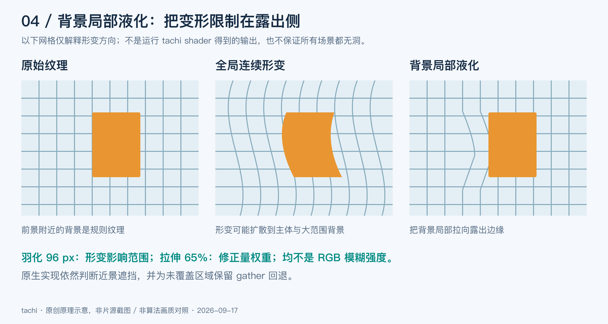

# 在手机上把 2D 视频变成 3D：tachi 的实时 SBS 实践

> 技术博客 · 2026-09-17。以 tachi `0f60ffb` 的实现和截至 9 月 16 日的实验记录为基线。本文记录一次方案收敛，后续配置以[实时 SBS 指南](../REALTIME_SBS.md)为准。插图均为原创原理示意，不是三个参考项目的运行截图，也不是实测画质对比。

把电影变成立体画面，乍看只有三步：估计深度，让近处和远处产生不同的左右眼位移，再把两张图拼成 SBS。但真正戴上眼镜，最先暴露的问题往往是人物边缘的重影、头发附近的跳动，以及背景像橡皮一样被拉长。

在 [tachi（塔奇）](https://github.com/buggzd/tachi) 中，我们希望 Android 手机一边播放 Jellyfin 视频，一边生成立体画面，再输出到 RayNeo 眼镜。这个目标同时约束画质、延迟、内存、解码、字幕和功耗。离线转换可以等待下一帧，播放器却必须决定：这一刻到底显示哪张画面？

我们最终采用的方案是 **392×224 深度估计、RGB 与深度严格同帧、GPU 背景局部液化**。它已经成为 v0.4.0 Full 的默认路线，当前观看效果获得了用户认可；在一次实际 Jellyfin 连续播放中，新配对画面的更新率平均为 22.54 Hz，持续 21 分 24.6 秒。它仍有背景形变和播放帧龄，也没有完成所有设备与音画同步验收。

理解这个选择，需要先看三个参考项目：**depth-surge-3d、qinglong-vr-3d、nunif / iw3**。它们给我们的启发，主要在深度图之后。

## 一、所谓“2D 叠加深度图”，实际改变的是采样坐标

深度图通常是一张灰度图，但把它半透明叠在 RGB 上，只会改变亮度。立体合成要做的是：根据深度，改变颜色在左右眼中的位置。

先区分 tachi 的两层功能。**平面 SBS 虚拟银幕**把同一张视频分别放入两个眼区，通过整张画面的缩放与平移调节银幕大小和会聚；它不需要深度模型。**实时 2D 转 3D**再为画面内部的不同物体产生不同视差。3840×1080 的并排传输中，右眼区相对左眼区多出的 1920 像素是排版位置，本身不是双目视差。

对归一化相对深度 `d`，tachi 的基础单眼位移可以写成：

```text
s_eye(x, y) = eye × W × 0.016 × strength × (d(x, y) − 0.5)
x_target   = x_source + s_eye(x_source, y)
```

`eye` 在两眼取相反符号，`W` 是每眼源图宽度；这里 `d` 越大表示越近。以 `W=1920`、`strength=0.85` 为例，未加局部修正时，单眼最大位移绝对值约 13.06 像素，双眼差的绝对值约 26.11 像素。0.016 是效果映射系数，不能解释成真实眼距；单目相对深度也不是以米为单位的距离。

困难发生在轮廓处。前景比背景移动得多，原先被挡住的背景就应该露出来；但原图从来没有记录过那部分颜色。


*图 1：新视角既有“谁挡住谁”的问题，也有“这里根本没有颜色”的问题。知道遮挡关系，仍然不能凭空获得背景。*

实现一般从两个方向入手：

- **前向投影**：从源像素出发，计算它落到目标图哪里。多个像素落在同一位置时，要解决近景遮挡；没有像素落到的位置，需要补洞。
- **反向采样**：逐个遍历目标像素，寻找应当从源图哪里取色。每个像素都能取到颜色，但坐标如果不对，仍会拉长前景、重复纹理或产生鬼影。

因此，“没有黑洞”和“生成正确的新视角”是两件事。

## 二、三个参考项目，三种值得拆开的实现


*图 2：比较的是所核对版本的具体路径，而不是项目整体优劣。上游与本地衍生实现必须分开讨论。*

### depth-surge-3d：解析视差与 OpenCV 反向采样

[Tok/depth-surge-3d](https://github.com/Tok/depth-surge-3d) 是面向离线视频转换的参考项目。本文核对版本为 [`2e65d8e`](https://github.com/Tok/depth-surge-3d/tree/2e65d8e2b981806c7506c9ce3da20f75342cb141)。它有视频深度估计和不同模型选项；我们重点看 `StereoPairGenerator` 调用的立体生成路径。[源码入口][ds-generator]

这条路径先在 `depth_to_disparity` 中计算：

```text
safe_depth   = max(depth, 0.001)
actual_depth = safe_depth × 10
disparity    = baseline × focal_length / actual_depth
```

随后，`create_shifted_image` 构造 `x ± disparity / 2` 的坐标，交给 OpenCV `remap` 双线性采样。**虽然变量名是 shifted，这里实际执行的是反向取色，不是把源像素前向散射到目标图。** 坐标还会先被限制在图像范围内。[函数实现][ds-imaging]

这个公式具有熟悉的 `bf/Z` 外形，但代码里“归一化深度乘 10”的尺度假设，并不能让任意相对深度模型自动获得物理标定。深度的方向、范围和几何意义仍要匹配。

其后可选的 `hole_fill_image` 在没有外部掩膜时，用全黑像素推测洞，再进行膨胀；fast 使用 Telea，advanced 使用 Navier–Stokes 修补并做双边滤波。这种掩膜来自颜色，不是严格的几何覆盖：有效的纯黑内容也可能进入掩膜，而错误采样出的非黑色鬼影不会因此被识别。

它给我们的参考是：深度估计、视差映射、取色、修补可以分阶段研究。但不能看到“有深度模型、有 inpaint”，就假定遮挡关系已经正确处理。本次只核对该版本源码，没有运行其完整转换流程，以上机制分析不是对其成片画质的实测评价。

### qinglong-vr-3d：显式处理边界、可见性和子像素覆盖

用户提供的 **qinglong-vr-3d** 本地源码保留了 depth-surge 的命名与项目结构，但其渲染核心已经有显著不同。这里将它作为独立参考对象，不把它的 Quality 实现归到 Tok 上游，也不根据一个没有 `.git` 的目录推断完整分叉历史。

它提供 Fast 和 Quality 两条路径。我们深入复现的是**相对深度 Quality 核心**。和直接对灰度图做双线性放大相比，它更关心轮廓两侧究竟属于哪个表面：[已保留的源码快照][qinglong-snapshot]

1. 在低分辨率深度上划分区域，再利用原图 RGB 的测地代价确定高分辨率区域归属，让轮廓尽量跟随图像边缘。
2. 按区域进行单侧深度重采样，减少前景深度和背景深度在轮廓处被直接混合；随后扩张前景 matte，保护细小前景的覆盖。
3. 沿水平方向采用 **16 个子像素覆盖槽**做前向 splat，判定近景遮挡，记录完整覆盖、部分覆盖和缺失覆盖。
4. 构造排除前景污染的背景代理掩膜，用 OpenCV Telea 修补，再按覆盖量合成。

16 个子像素槽细化的是覆盖判定，并没有增加 16 倍真实背景信息。RGB 引导也依赖一个假设：图像边缘能帮助判断深度边界；遇到衣服纹理、阴影或低对比轮廓时，这个假设未必成立。

这里还要区分“源码中存在”与“实际运行”。快照里保留了 planner、exemplar 等依赖，但我们复现的活跃修补路径是**背景代理 / Telea / 覆盖合成**，不能写成已经运行了所有高级补洞方法。

我们实际隔离复用了 22 个实现文件，保留 MIT 声明与逐文件 SHA-256，没有启动原项目应用或安装器。输入使用 tachi 缓存的 392 深度；未复现原项目的完整模型与上游归一化流程。因此，这是控制输入后的渲染核心对照，不是两套完整产品的比赛。[实验范围][quality-temporal]

这条路线让我们更清楚地看到洞在哪里、修补了什么。但在当时的片段与设置下，用户反馈完整 Quality 并没有带来更满意的观看效果。Telea 可以延续邻域颜色，却不知道人物背后的线条应该怎样连接；细线、颜色扩散和运动边界仍是难点。

### nunif / iw3：让网络预测“去哪里取颜色”

[nunif / iw3](https://github.com/nagadomi/nunif/blob/master/iw3/README.md) 的方法选择很多。本文核对 [`d23721f`](https://github.com/nagadomi/nunif/tree/d23721f1b5f0a4c92c3ee1be013180bf298730c5)，重点讨论 README 中的默认 **RowFlowV3**。[方法表][iw3-methods]

它在深度估计之外，再使用一个立体变换模型：把深度、立体强度和会聚特征输入网络，预测横向采样偏移 `delta`，纵向偏移置零。默认 delta 推理路径不把 RGB 送入偏移预测器；最后才根据坐标从 RGB 取色。[模型][iw3-model] · [采样实现][iw3-warp]

```text
深度 + 强度 + 会聚 → RowFlowV3 → 横向采样偏移
原始 RGB + 采样网格           → grid_sample → 单眼画面
```

偏移预测可以在低于原图的尺寸运行，再把网格插值到原图尺寸。这个“网格”是密集采样坐标场，不必是图形 API 中的三角网格；名字中的 Flow 也不是相邻视频帧之间的光流。

与简单反向采样相比，区别在于**采样坐标是学习出来的**。README 说明 RowFlowV3 使用 `forward_fill` 生成的合成立体训练数据。它学习如何组织遮挡边缘附近的采样，而不是只把深度值直接代入位移公式。

但它仍从原图取颜色，并非生成隐藏背景的 RGB 模型。默认普通设备的越界采样使用 border，MPS 路径使用 reflection；这能给越界位置一个颜色，不能证明背景恢复正确，也不能据此保证采样场严格单调。

iw3 还提供深度排序的 `forward_fill`、带修补的 `forward_inpaint` 和多层反向 warp 的 MLBW。MLBW 可以预测多层偏移与混合权重，不能与默认 RowFlowV3 混称。我们只做过源码研究，没有运行 iw3 权重，也没有证明它能直接部署到当前 QNN 管线。[阅读记录](2026-09-14-iw3-warp.md)

## 三、我们试过的路线，为什么没有直接留下来

最早的 tachi 像素合成器使用 **gather33**。对每个目标像素，它检查横向 33 个源候选，计算候选投影后离目标位置有多远。在误差小于 0.75 个基准像素的候选中优先选择近景；找不到覆盖时，选投影误差最小者。

这比完全不判断遮挡的取色更可控，也方便在 GPU 中实现。但缺失区域的“最接近候选”不一定属于背景，可能把前景颜色拉长。深度轻微变化还可能触发候选切换，于是静态截图看起来尚可，播放起来却在跳边。

后来的实验逐渐把问题拆成三类：**深度估计误差、几何合成误差、视频与深度的时间错位**。三者外观相似，处理方法却不同。

| 尝试 | 我们观察到什么 | 最后的取舍 |
| --- | --- | --- |
| 提高真实推理分辨率 | 部分片段的轮廓更好，但匿名反馈并非一致偏好 392；有一段仍偏好 266 基准，且评分只有 2/5 | 提高分辨率有价值，但不能替代时序与几何处理 |
| 同坐标历史融合、范围 EMA | 能压住静态噪声；运动时同一坐标可能已经换了物体，产生拖尾与迟滞 | 当前同帧主路线关闭像素历史融合和范围 EMA |
| 历史裁剪、软化门限 | 某些合成指标改善，另一些低对比快移场景退化 | 不用一个平均分掩盖反例 |
| Guided / 联合双边细化 | 桌面测试中，前者未改善边界指标；后者全图误差略降，边界 F1 却退化 | 没有把这两个 CPU 原型搬进产品 |
| 少次迭代逆投影 | 平滑区域明显更快，但薄线与深度断层处会选错表面 | 保留实验，未直接替换可见性搜索 |
| 透视网格、断边网格 | 连续三角形跨深度断层会把背景连成斜坡；断开三角形又显露更多洞 | 更接近几何建模不等于自动解决缺失背景 |
| 全局无洞弹性网格 | 限制每行格宽为正并固定两端，可以全覆盖，但会改变会聚并拉扯主体 | 人物胖瘦与大范围形变使它不成为主线 |
| qinglong 完整 Quality | 覆盖诊断更明确，复杂边界处理仍未在本次对照中赢得用户偏好 | 保留核心复现与负结果，暂停主线投入 |
| 前后帧时序补洞 | 能找到其他时刻出现过的背景，但动态背景、非刚体和深度错位仍会失败 | 未进入手机播放器 |

这些结果来自不同层级：既有桌面合成测试，也有网页主观对照和手机测量，不能拼成统一排名。详细条件见[路线归档](2026-09-14-sbs-route-survey.md)、[桌面优化报告](../performance/2026-09-11-desktop-optimization/README.md)和[匿名评分](../performance/2026-09-12-quality-trials/user-ratings.md)。

时序补洞尤其值得展开。我们尝试从前后 1、3 帧提取背景，用双向 DIS 匹配可见区域，经深度、颜色和前后向检查后，再用 RANSAC 仿射模型外推背景运动。三个片段中，缺失覆盖像素采用前后帧颜色的比例分别约为 26.41%、63.75%、67.92%。**这是采用比例，不是恢复正确率。** 洞里没有直接可追踪的颜色，仿射外推也无法表达所有运动。

此外，24 fps 视频的未来 3 帧意味着约 125 ms 预读，尚未计算模型、补洞和同步开销。对离线转换，这是时间成本；对手机播放器，这是必须与音频、字幕一起处理的延迟。[时序实验][quality-temporal]

## 四、先让 RGB 和深度属于同一帧

一度，我们尝试让视频继续流畅前进，深度慢一点更新，显示时持有最近的深度结果。这样不会因为推理慢而停住视频，但运动人物已经到了新位置，深度轮廓还停在旧位置。即便深度模型和补洞各自都正确，组合起来也会错。


*图 3：同帧的含义是 `RGB t` 只和 `Depth(RGB t)` 组合。图中用两帧延迟举例；当前实现没有固定延后两帧。*

我们做过桌面光流传播：把迟到的深度沿有界历史传播到当前画面。在一个合成移动前景测试中，带可信度检查的 DIS 方案使轮廓误差下降约 63%，但新露出区域的误差仍然明显。运动传播值得研究，却也新增了遮挡置信度、每帧运动输入和端侧成本问题，尚未原生接入。

当前选择更直接：**捕获模型小图时，同时保留对应的全尺寸 RGB；深度处理完成后，整对提交。** 繁忙时重复上一对，接受运动更新率降低，不把旧深度套到最新视频上。

深度范围也改为逐帧精确 P2/P98：取当前深度值的第 2、第 98 百分位作为两端，在有效范围内计算 `d = clamp((raw − P2) / (P98 − P2), 0, 1)`。它减少极端值对视差范围的支配，不沿用旧范围，也不混合旧像素。这保留了当前帧的响应，但没有消除逐帧尺度变化；不能把取消历史滤波理解成普遍更稳定。

这项选择切断了一个明确的鬼影来源，却没有让时间消失。成对 RGB 的 PTS 与深度 PTS 可以完全一致，而它们仍落后于最新解码帧和播放器时钟。因此必须同时记录配对一致性和画面帧龄。字幕现在优先使用配对位置，音频没有固定延迟补偿，音画同步仍需独立验证。

## 五、背景局部液化：保留局部形变，减少错误补色

同帧之后，我们再观察几何本身。用户最终认可的是一种局部折中：保留基础立体位移，在新露出侧把附近背景纹理连续拉到轮廓附近，并把形变分散在有限羽化范围内。



*图 4：局部液化改变的是坐标场。图中弯线用于展示代价，并非实测算法输出；真实场景仍可能出现直线弯曲与果冻感。*

当前 GLES 3.1 实现分为三个阶段。[位移 shader][liquid-field] · [重建 shader][liquid-render]

**先识别背景侧。** 在深度小图上，针对左右眼向相反方向搜索。遇到更近的深度时，用连续门控评估深度差，把修正量种在可能露出的背景侧。深度差门控范围为 0.025–0.12，距离权重在 96 个每眼源图基准像素内逐渐衰减。

**再沿相近深度扩散。** 对修正场做八轮二维深度引导扩散，连接相邻行，减少各行独立处理造成的不连续；跨明显深度边缘的传播受到抑制。扩散对象是位移修正，不是 RGB 颜色。标准路径复用三张低分辨率 RGBA32F 纹理，使用工作组共享邻域。

用简化记号，最终位移可以写成：

```text
s_eye = eye × W × 0.016 × 0.85 × [(d − 0.5) + 0.65 × c_eye]
```

`c_eye` 是按眼方向计算并扩散后的背景修正量。这也说明几个参数的意义：**0.85 是基础位移强度，96 px 是羽化范围，65% 是背景修正权重**。96 px 按每眼 1920 源宽换算，不是双眼总宽，也不是手机 CSS 像素；65% 不代表“把整张背景放大 65%”。

**最后连续重建。** 单个源采样点拉伸后，可能覆盖超过一个目标像素，只检查离散点会重新产生缝隙。当前渲染器检查相邻源点投影形成的连续区间，在区间内反求取色位置，再按近景优先解决竞争。如果仍找不到覆盖，沿用原 gather 思路回退。

所以这条路线既不是生成式补全，也不是完全取消遮挡判定的简单反向 warp。它通过已有背景纹理的局部形变减轻缺口，保留可见性搜索，并承认仍有未覆盖区域。

代价同样明确：背景直线可能弯曲，纹理可能被拉长，低分辨率深度边界仍会选错。严格同帧也不能让网络漏掉的发丝重新出现，更不能保证人物内部完全刚性。我们选择它，是因为在本次观看反馈和端侧约束下，这组代价比此前的错误填色和大范围形变更可接受。

## 六、手机端最难的部分，是让整条流水线按时交接

当前 Full 使用 Depth Anything V2 Small，392×224 固定输入，U16 activations / I8 weights，通过 ORT QNN 在 HTP 推理。已验证设备是 SM8850 / V81；这不是所有 Android 手机的兼容性声明。[当前主路线](../SBS_TECHNICAL_ROUTES.md)


*图 5：主机输入与输出交接仍在。GPU 做了预处理，并不等于整个播放器已经零拷贝。*

### 模型分辨率要和时间预算一起看

24 Hz 给每次新配对约 41.67 ms 的节拍。我们测过真正重新固定形状、校准的多个模型，而不是把小深度图放大后称为高分辨率：

| 历史扫描配置 | NPU 推理均值 | 当时说明 |
| --- | ---: | --- |
| 266×154 | 18.29 ms | 非调试构建与 ART 预编译对照 |
| 392×224 | 32.68 ms | 同组对照，保留了后续流水线优化空间 |
| 518×294 | 57.08 ms | 同组对照，单次串行推理已超过 24 Hz 周期 |
| 644×364 | 99.33 ms | 另一组初始扫描，不能与上面直接计算整机提升比例 |
| 770×434 | 未完成 | 在会话创建阶段发生原生分配失败，尚未进入推理 |

[分辨率扫描报告](../performance/2026-09-13-resolution-sweep/README.md)中的 518 约 8 Hz 是旧 CPU 后处理管线结果；后续 GPU 与流水线优化曾让 518 达到 12 Hz。旧实验记录必须带上当时条件，不能被当成永久上限。

### 原生播放让帧、时间戳和缓冲归属可控

早期实验经过 HTML video、Canvas / WebGL 取帧和跨桥推理。它适合快速建立对照，但手机上的读回、桥接和调度都要计入预算。后来 Android 视频播放迁移到 Media3 / MediaCodec，解码输出 OES 纹理，GPU 生成模型小图与 CHW 标准化输入；WebView 保留目录、控制和字幕层，Android 播放路径不再创建 HTML `<video>`。

这让我们能明确规定每张 RGB 纹理何时捕获、属于哪个 PTS、什么时候可以复用。但当前 ORT QNN 产品路径仍要把输入交给主机缓冲，再交接模型输出；它不是零拷贝。

我们已有完整模型注册共享缓冲的独立 benchmark：AHardwareBuffer 可同时用于 GPU SSBO 与 QNN I/O。但那个测试不包含完整播放器预处理、液化与呈现，并且同步方式仍含 `glFinish`。它证明后续方向可行，尚不能写成产品已经获得的收益。[共享缓冲证据](../performance/2026-09-13-daily-sbs/README.md#完整模型共享缓冲)

### 两个捕获槽，控制吞吐也控制帧龄

NPU 推理串行，但 GPU 捕获、后处理可以与其他阶段重叠。两个捕获槽分别持有模型输入与同源全尺寸 RGB，直到结果被接受或拒绝才释放；显示用的深度也独立保存，避免下一次推理覆盖正在显示的一对。

无限加槽可能提高提交数量，却让排队中的画面越来越旧。我们选择有界工作量：槽忙就跳过采样，重复显示有效配对。seek、换源、关闭和 Surface 重建必须使旧代结果与缓存失效，否则会把跳转前的画面重新显示出来。

重复显示时，已经合成的 SBS FBO 可以复用，不必重新做完整双眼搜索。两个 1920×1080 RGBA8 眼图的缓存约占 15.8 MiB；这是缓存本身，不是应用总内存，也不包括 RGB 捕获槽和模型资源。

### 排队顺序，往往比少几次算术更重要

一个有效优化是：接受配对后先释放槽并尝试补采，再立即提交当前配对的液化，让下一次输入的 fence 有机会排在昂贵液化之前。

同一 HLS / ASS 片段的顺序短测中，新配对从 **22.68 提高到 23.62 Hz**，捕获到绘制开始从 **85.80 降到 82.06 ms**。更早的候选把液化推迟到下一次绘制，虽然捕获到上传更快，却增加了后续等待；只盯上传时间，就会采纳一个没有改善下游延迟的版本。[排队实验](../performance/2026-09-15-capture-order/README.md)

我们也试过把八轮扩散合并成更少 dispatch，以及复用重建搜索的终点采样。实际 GLES 等价检查通过，但完整播放器三轮约三分钟测得 **23.74 / 23.61 / 23.53 Hz**，没有明确端到端提帧。两个开关因此保留为实验选项，默认关闭。[shader 对照](../performance/2026-09-16-liquid-shaders/README.md)

这些短测是顺序运行，没有完全控制温度和频率，不能把小幅差异全部归因到代码，更不能外推续航。

## 七、现在跑到了哪里，还有什么没有解决

最有代表性的持续播放记录来自完整 tachi 的 Jellyfin 入口：SM8850/V81、RayNeo Air 3s 外接 3840×1080，HEVC 视频、WebVTT 字幕，充电环境，连续有效窗口 1284.576 秒。[完整实测](../performance/2026-09-15-native-liquid-product/README.md)

| 指标 | 结果 | 应当怎样理解 |
| --- | ---: | --- |
| 新配对画面 | 28,949 对，平均 22.54 Hz | 实际转换更新率，尚非稳定 24 Hz |
| 软件视频与配对 PTS 差 | 均值 93.63 ms，P95 126 ms | 软件帧龄信号，不是光学端到端延迟 |
| Media3 解码丢帧增量 | 0 | 不代表每个解码帧都完成了 3D 转换 |
| GL 消费跨过的解码帧 | 31 | 与解码器丢帧、物理呈现丢帧不同 |
| 重复缓存绘制 | 47,836 次 | 复用已有画面，不计为新转换帧 |
| 应用 PSS | 约 930–959 MiB | 包含 QNN、播放器和 WebView，不是深度图大小 |

屏幕以约 60 Hz 呈现，并不意味着每秒生成了 60 张新立体画面。类似地，CPU 提交 GPU 命令只花很短时间，并不等于 GPU 已经完成工作；fence 被轮询观察到的时间，也不等于精确的 GPU 完成时刻。阶段之间有重叠，不能把各项均值或 P95 相加作为总延迟。

后续仍需收敛显示生命周期、不同编码与字幕、独立音画同步，以及非充电条件下的长时温控。算法方面，当前仍承受单帧深度模型的轮廓误差、逐帧尺度变化和背景形变；视频深度模型、iw3 式学习型采样场、生成式补洞都只是研究储备，没有被这轮实验验证为手机上的下一步必选项。

这次实践最有价值的变化，是我们开始按因果关系看画面：模型估计的边界是否正确，颜色与深度是否同帧，新视角需要的背景是否存在，最后才是怎样在手机预算内把它显示出来。tachi 当前的同帧局部液化，正是这些问题共同约束下的一次工程选择。

## 源码与实验索引

三份参考资料采用不同证据范围：Tok 上游与 iw3 为固定提交的源码阅读；qinglong 为用户提供的本地源码及已实际执行的隔离渲染核心。本文未新增模型推理、手机跑分或跨项目画质测评。

- **depth-surge-3d**：[`StereoPairGenerator`][ds-generator]、[`image_processing.py`][ds-imaging]。版本 `2e65d8e2b981806c7506c9ce3da20f75342cb141`。
- **qinglong-vr-3d**：[隔离快照说明][qinglong-snapshot]、[来源文件哈希](../../StereoLab/vendor/qinglong-quality/SOURCE_HASHES.json)、[Quality 几何](../../StereoLab/vendor/qinglong-quality/depth_surge_3d/rendering/quality/geometry.py)、[覆盖与修补](../../StereoLab/vendor/qinglong-quality/depth_surge_3d/rendering/quality/renderer.py)。本地快照无可核验的 Git 提交，使用文件哈希追溯。
- **nunif / iw3**：[方法表][iw3-methods]、[RowFlowV3][iw3-model]、[反向 warp][iw3-warp]。版本 `d23721f1b5f0a4c92c3ee1be013180bf298730c5`。
- **tachi 当前实现**：[GPU 位移场][liquid-field]、[双眼重建][liquid-render]、[原生帧调度](../../AndroidApp/native-video/src/main/java/com/jellyfinforrayneo/video/NativeVideoView.java)、[主路线](../SBS_TECHNICAL_ROUTES.md)。仓库相对源码链接随检出版本变化，本文叙述基线为 `0f60ffb`。
- **实验全过程**：[算法路线归档](2026-09-14-sbs-route-survey.md)、[完整 Quality 与时序补洞][quality-temporal]、[原生液化移植](../performance/2026-09-14-native-liquid/README.md)、[现行构建与验收边界](../REALTIME_SBS.md)。
- **插图**：[SVG 源文件与 PNG 导出说明](../images/sbs-blog-2026-09-17/README.md)。

[ds-generator]: https://github.com/Tok/depth-surge-3d/blob/2e65d8e2b981806c7506c9ce3da20f75342cb141/src/depth_surge_3d/processing/frames/stereo_generator.py
[ds-imaging]: https://github.com/Tok/depth-surge-3d/blob/2e65d8e2b981806c7506c9ce3da20f75342cb141/src/depth_surge_3d/utils/imaging/image_processing.py
[qinglong-snapshot]: ../../StereoLab/vendor/qinglong-quality/README.md
[quality-temporal]: ../performance/2026-09-14-quality-temporal/README.md
[iw3-methods]: https://github.com/nagadomi/nunif/blob/d23721f1b5f0a4c92c3ee1be013180bf298730c5/iw3/README.md#stereo-generation-method-left-right-image-generation
[iw3-model]: https://github.com/nagadomi/nunif/blob/d23721f1b5f0a4c92c3ee1be013180bf298730c5/iw3/models/row_flow_v3.py
[iw3-warp]: https://github.com/nagadomi/nunif/blob/d23721f1b5f0a4c92c3ee1be013180bf298730c5/iw3/backward_warp.py
[liquid-field]: ../../AndroidApp/native-video/src/main/assets/gpu-liquid/field.comp
[liquid-render]: ../../AndroidApp/native-video/src/main/assets/gpu-liquid/render.frag
