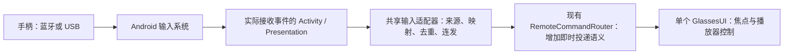

# Android 手柄接入调研

日期：2026-09-20。代码基线：`93735d57cc5cc768789670aa3cb1b2c0eaaac98e`。

本报告依据 Android 官方文档、MDN 与 tachi 源码，讨论手柄连接**运行 tachi 的 Android 手机**、控制眼镜浏览与播放的方式。本轮仅做调研，没有实现适配，也没有连接真实手柄测量；具体型号、固件、连接模式和手机系统兼容性仍待验证。以下建议不代表已经实现的功能或已确定的产品要求。

## 结论

建议使用 **Android 原生输入事件 + 现有 RemoteCommandRouter**，首轮覆盖十字键、左摇杆、确认和返回，优先验证蓝牙连接。系统识别为输入设备后，蓝牙与 USB 手柄可以共用同一套事件处理逻辑。[1]

tachi 已有方向键到眼镜空间焦点的完整链路，主要缺口在原生输入识别、轴转方向、按下/松开与连发管理，以及双窗口路由。基础适配不需要厂商 SDK、应用内蓝牙协议、额外播放器或另一个 WebView。手机仍负责配对、登录与复杂文字输入。

## 1. 物理连接与权限边界

| 方式 | Android 与应用的职责 | 对 tachi 的适用性 |
| --- | --- | --- |
| 蓝牙手柄 | 用户在系统设置配对；系统处理受支持的 HID 输入，应用接收 `KeyEvent` / `MotionEvent` | 优先验证；不占用眼镜所用 USB-C 接口 |
| USB 有线手柄 | 手机需支持 USB Host，且系统驱动能识别该手柄；识别后仍走输入事件 | 可作为后续验证项；同时连接眼镜需要兼容的扩展连接方案 |
| 2.4G 无线接收器 | 对手机通常表现为 USB 外设，能否成为输入设备取决于接收器协议与系统驱动 | 不能把“无线”理解为“无需 USB”；按 USB 场景验收 |
| 厂商私有协议、映射器专用模式 | 可能需要厂商 SDK、专用协议或映射软件，未必提供标准输入事件 | 首轮不作为通用适配前提；优先切换到 Android 可识别的手柄模式 |

接收**系统已经分发的输入事件**不要求应用扫描或直连蓝牙设备，因此基础方案不需要新增蓝牙/定位运行时权限。若将来在应用内扫描、配对或直接通信，才需要按目标 SDK 和系统版本重新评估蓝牙权限；不能把 Android 12+ 的直接蓝牙通信权限要求套到普通按键接收上。[1][6]

同理，标准 USB 输入事件与应用通过 `UsbManager` 直接读写端点是两条不同路径。后者需要设备授权与协议处理；已有 RayNeo USB 控制授权不是手柄授权，也不应把手柄接进眼镜的 USB 控制代码。[7]

USB-C 扩展设备还须实际支持眼镜所需的视频输出、USB 数据与供电组合；普通 USB Hub 或仅充电分线器不能据此认定可用。系统不识别某个接收器时，增加 Java 按键映射通常无法解决底层驱动问题。

## 2. Android 提供的接口

### 按键与轴

| 输入 | 常见 Android 表示 | 处理要点 |
| --- | --- | --- |
| 面板键 | `KEYCODE_BUTTON_A/B/X/Y` | `KeyEvent`，区分 DOWN、UP、取消和 `repeatCount` |
| 十字键 | `KEYCODE_DPAD_*` 或 `AXIS_HAT_X/Y` | 必须兼容两种表示，并避免重复触发 |
| 左摇杆 | `AXIS_X/Y`，按下为 `BUTTON_THUMBL` | 轴一般为 -1～1，需要死区与方向量化 |
| 右摇杆 | `AXIS_Z/RZ`，按下为 `BUTTON_THUMBR` | 不应把右摇杆轴名直接假定为 RX/RY |
| 肩键 | `BUTTON_L1/R1` | 离散按键 |
| 扳机 | `AXIS_LTRIGGER/RTRIGGER`、兼容轴 `BRAKE/GAS`，或 `BUTTON_L2/R2` | 可同时产生轴与按键；同一次动作只能执行一次 |
| 菜单键 | `BUTTON_START/SELECT` | 产品可选映射；不假定所有设备都有 |

上述为官方约定，真实设备仍可能因连接模式、固件和 Android 映射不同而变化。[1]

在原生 View 层可处理 `onKeyDown`、`onKeyUp` 和 `onGenericMotionEvent`；Activity 可通过 `dispatchKeyEvent` / `dispatchGenericMotionEvent` 在子 View 之前统一处理。tachi 已经使用前一个 Activity 入口，适合扩展为独立的输入适配器。[1]

识别输入时应结合事件来源与设备能力：

- `SOURCE_GAMEPAD`：手柄按键；`SOURCE_JOYSTICK`：摇杆；`SOURCE_DPAD`：方向输入。仅有 DPAD 的设备也可能是遥控器，不能全部标为完整手柄。
- 使用 `event.isFromSource(...)` / `device.supportsSource(...)`，或完整位掩码比较。来源可以组合，不能直接用等号比较整个 source，也不能只判断按位与非零。
- `InputDevice.getMotionRange(axis, source)` 提供轴是否存在及范围；`getFlat()` 用于识别中立死区。相同轴名在触摸屏和手柄上的含义不同，必须先确认来源。[1][4]
- 使用 Android `keyCode`，不把设备原始 `scanCode` 当通用映射。官方以物理位置归一面板键：标准映射下 `BUTTON_A` 为下方按键，Switch 布局上可能印着 B；PlayStation 下方通常是叉号。界面提示需区分位置与印字，不能仅凭品牌名称认定键位。[1]

只消费应用明确拥有并处理的事件，其余交回 `super`，保留系统兼容行为。已接管按键的匹配 UP、被抑制的重复 DOWN 和已接管轴的回中事件也属于状态处理，不能再泄漏到 WebView 形成第二次导航。[1]

### 连接状态与版本

使用 `InputManager.InputDeviceListener` 的 added / changed / removed 回调；启动和恢复时枚举已经连接的设备，changed 后重新读取设备能力，removed 时清理对应按住状态与连发任务。[2][3]

运行中按 `deviceId` 管理状态；这个 ID 在重连后可能改变。若后续持久化按键配置，可考虑 descriptor，但它不保证每个物理实例都唯一，不应输出到公开诊断或当作账号标识。[4]

项目当前 `minSdk 26`、`compileSdk 35`、`targetSdk 29`。基础按键/轴、监听器、`hasKeys` 和 `supportsSource` 都早于 minSdk，无需照搬官方旧示例中 API 12～15 的轮询兼容层，也无需为了基础手柄支持升级 SDK 基线。[3][4][8]

## 3. 应用层接入方案比较

| 方案 | 优势与成本 | 建议 |
| --- | --- | --- |
| Java 原生输入 → 现有遥控命令 | 与现有 Activity/桥接一致；可统一处理来源、按键生命周期、双窗口和断连 | 首选 |
| GlassesUI 使用浏览器 Gamepad API | 适合浏览器预览；需要获取最新按键/轴状态，受浏览器映射、页面焦点/可见性等条件影响 | 可选开发工具，不作为 Android 产品输入的唯一入口 |
| AGDK Game Controller Library（Paddleboat） | 提供标准化数据、连接回调、按键布局、设备映射及部分震动/灯光等能力；集成涉及 NDK、CMake 和 C/C++ 接口 | 出现大量已证实的设备映射问题或高级需求后再评估 |
| 自己实现 Bluetooth/USB HID 或厂商协议 | 直接通信和权限、兼容性维护成本高 | 标准系统输入不能覆盖且产品明确需要某设备时才考虑 |

Paddleboat 是官方方案，但不是 Java 应用支持手柄的必需依赖。tachi 虽已有原生视频模块，也没有必要仅为菜单导航把输入接入 C++ 播放管线。[5]

MDN 的 Gamepad API 文档描述了焦点页面接收连接事件及通过 `navigator.getGamepads()` 获取最新状态的方式。tachi 的眼镜 WebView 在外接 Presentation 中，手机可能持有窗口焦点，且页面来自本地 assets。因此是否暴露 Gamepad API、具体 WebView 版本及焦点行为都需实测，不能用桌面 Chrome 成功推断 APK 可用，也不能未经验证断言 Android WebView 一概不支持。[9]

## 4. 当前代码已经具备什么

| 位置 | 基线观察 | 对适配的影响 |
| --- | --- | --- |
| [MainActivity.java](../../AndroidApp/app/src/main/java/com/jellyfinforrayneo/client/MainActivity.java)，`dispatchKeyEvent` / `commandForKey` | 显式映射 DPAD 四向、DPAD_CENTER 和 ENTER；仅在 DOWN 提交；另有音量键处理 | 部分手柄可能已有基础方向操作；未显式映射 A/B，也没有摇杆事件入口，不能宣称完整支持 |
| 同文件，`onBackPressed` | 根据手机 `webScreen` 决定眼镜返回或手机页面返回 | 手柄 B、手柄产生的 BACK 与手机系统返回必须明确路由，避免错误退出或两端一起返回 |
| [RemoteCommandRouter.java](../../AndroidApp/app/src/main/java/com/jellyfinforrayneo/client/RemoteCommandRouter.java) | 方向/确认/返回会进入最多 32 条的待发队列；seek/scrub 不重连重放 | 手柄连续方向不能直接使用现有离线排队语义；`submit()` 返回 true 不代表已送达眼镜 |
| [GlassesWebViewController.java](../../AndroidApp/app/src/main/java/com/jellyfinforrayneo/client/GlassesWebViewController.java)，`dispatchCommand` | 同时发布 remote 通知与冒泡 `keydown`；映射为 Arrow、Enter、Escape | 可复用；一个动作不能再由另一套 Gamepad 监听重复执行。合成键事件目前不携带按住状态或 `repeat` 信息 |
| [GlassesPresentationController.java](../../AndroidApp/app/src/main/java/com/jellyfinforrayneo/client/GlassesPresentationController.java) | 外接显示有独立 Presentation/Window，目前未覆盖手柄事件分发 | 不能仅凭手机 Activity 接到键盘就认定所有窗口场景都能接到手柄 |
| [GlassesUI App.tsx](../../GlassesUI/src/App.tsx)，全局键盘和 `lucent-player-key` 监听 | 已有单一空间焦点、播放器控制域和字幕/音轨面板导航 | 方向/确认/返回足够覆盖基础浏览与播放，无需改为鼠标光标 |
| [RemoteTutorial.tsx](../../GlassesUI/src/RemoteTutorial.tsx) | 只消费键盘路径，文案/插图仍面向手机手势 | 手柄能产生同样命令不等于教程已适配；需补手柄提示或提供清楚的跳过入口 |

当前播放器在控制条隐藏时，左右方向直接 ±10 秒，Enter 切换播放/暂停；控制条可见时 Enter 激活当前焦点，进度条聚焦时左右跳转。面板优先处理方向、确认和返回。这些都是现有行为，不能把“手柄 A 映射 Enter”描述为任何时刻都播放/暂停。

## 5. 建议的基础实现范围

新增一个原生 `GamepadInputController`（建议名称），把可单测的方向量化、按键状态和时间策略与 Android 分发代码分开。原始轴数据留在原生层，跨 WebView 仅发送有界语义命令。继续保持一份 SessionRepository、一份眼镜 WebView 和一份 Media3 播放器。

### 建议映射

| 操作 | 首轮语义 |
| --- | --- |
| 十字键 / 左摇杆 | `up` / `down` / `left` / `right` |
| 标准布局下方键：A / 叉号 | `enter`，确认当前焦点；播放时继承现有上下文语义 |
| 标准布局右方键：B / 圆圈 | `back`，关闭当前面板或返回当前眼镜页面 |
| Android 已映射的 DPAD_CENTER / ENTER | 保留既有确认能力 |
| 手柄设备发出的 KEYCODE_BACK | 在明确接管眼镜输入时按同一次返回处理；手机返回保持原有语义 |

第一轮暂不赋予右摇杆、X/Y、L/R、扳机和摇杆按下新快捷行为。Start 专用播放/暂停、肩键跳转、音量和重映射可作为后续独立设计。当前命令白名单没有专用播放/暂停命令；不能把 Start 简单映射 Enter 并称为可靠的播放开关。系统 Home/Guide 键也不能假定一定分发给应用。

### 必须同时处理的状态规则

1. **输入归属**：首轮建议仅在手机触控遥控页、有效会话及眼镜可交互时接管手柄导航。登录、账号和手机设置继续由手机操作；搜索 IME、系统弹窗及焦点切换单独验证。现有 `glassesWebReady` 只表示本地页面 ready，不等于媒体目录已经 ready。
2. **双窗口**：先确认目标手机上按键和轴实际到达哪个 Window；必要时由 Activity 和 Presentation 共用同一个适配器。每个已处理事件只消费一次，不通过抢焦点解决输入路由，也不把 Activity 失焦一律误判为整个应用退后台。
3. **确认/返回单次触发**：一次完整按压只提交一次，重复 DOWN 仅消费；处理匹配 UP 和取消。重连、恢复或上下文切换后，旧按压不能被当作新点击；按键释放、摇杆回中后才重新开始。
4. **方向连发**：首次移动立即一步，持续按住后再有节制地重复。例如首延迟 350 ms、间隔 120 ms 可作为待调试起点，而非实测参数。键盘重复与自建计时只能由一个机制负责，不能叠加。只有持有有效方向时才安排任务，松开/回中即停。
5. **摇杆死区与滞回**：尊重 `MotionRange.flat`，再按菜单操作需求设置激活/释放阈值；例如规范化后的 0.55 / 0.35 仅是调试起点。斜推先取主要轴并保持方向稳定，避免左右上下抖动。摇杆保持偏转时不能依赖设备持续发送新的 MOVE 才连发。
6. **重复来源与批次**：同一设备的 DPAD 键与 HAT 轴合成一个方向状态；十字键与摇杆同时操作要有明确优先级。MotionEvent 可能携带历史样本，处理时尊重顺序和回中，避免把每个历史样本都立即变成一次焦点移动。扳机若后续启用，同样要合并轴/按键来源。[1]
7. **过期输入丢弃**：为手柄增加明确“不排队”的即时提交路径，实际投递失败即丢弃；仅在适配器前检查 ready 仍不足以解决 sink 失败后入队。断连、失去可交互上下文、后台、注销、切账号、renderer 重建和模式转换时取消按住状态；恢复后不补发旧连击。
8. **有限状态与保留默认输入**：设备状态集合和任务数量有界，多设备按 deviceId 隔离；可先由一个活跃手柄控制，切换时清除旧连发。手机触控仍可使用，输入切换不产生双重动作。未映射输入交回系统；原有音量键逻辑独立保留。

断开手柄首先应停止导航并保留手机触控可用。是否暂停正在播放的视频属于产品策略，不照搬游戏文档的“断开即暂停游戏”，也不自动改变现有媒体生命周期。[2]

## 6. 后续验证清单

| 层次 | 需要验证 | 通过标准 |
| --- | --- | --- |
| 纯逻辑/JVM | 来源分类、DPAD/HAT 去重、死区/滞回、斜推、按住/松开、A/B 不连发、断连和恢复、即时发送失败 | 一个动作一次语义执行；回中/断连后无新命令；无重放 |
| 真机输入 | 至少各一类 Xbox、PlayStation、Switch 风格或通用 Android 手柄，记录固件/连接模式；蓝牙优先，USB/接收器另测 | 以实收 KeyEvent/MotionEvent 与实际导航为证据，不按品牌推断兼容 |
| 双显示/焦点 | Mirror 2D、SBS、手机与 Presentation 焦点、IME、弹窗、插拔、切模式、后台恢复 | 焦点唯一、无双端误操作，无陈旧连发；没有额外 WebView/播放器 |
| 浏览 | 首页、长列表、详情、搜索字符条、对话框、设置、教程 | 方向可预测，确认一次，返回一级；教程提示可理解且可退出 |
| 播放 | 隐藏/显示控制条、进度条、音轨/字幕面板、暂停、direct/HLS、按住左右 | 跳转有界，无意外多次暂停切换；单音轨/单上报生命周期保持 |
| 回归 | 手机触控、键盘、系统返回、音量、会话清理、renderer 恢复 | 原有输入与架构约束不退化 |

诊断优先使用有限条的按键码、来源、轴枚举、范围和连接事件；不采集任意输入文本、蓝牙地址、descriptor 或完整系统 dump。型号/固件由测试者记录。`adb shell input keyevent` 仅能验证部分命令链路，不能证明真实手柄来源、模拟轴、驱动映射和热插拔兼容。

开始实施后，按仓库要求完成两个前端构建、GlassesUI check、JVM 测试、lint、APK assembly 和 `scripts/verify-android.sh`，再执行 [设备回归矩阵](../ANDROID_ARCHITECTURE.md#device-regression-matrix) 的相关项。只有完成实现与相应验证，才更新当前指南和路线图中的支持声明。

## 7. 资料来源

以下页面于本轮实际读取；Android 页面使用 Google 官方中国开发者站。连接方式、SDK 选择和状态策略中针对 tachi 的结论属于基于这些资料与源码的工程建议。

1. [Android：Handle controller actions](https://developer.android.google.cn/develop/ui/views/touch-and-input/game-controllers/controller-input?hl=en) — 按键/轴、事件分发、来源、死区、键位风格与重复事件。
2. [Android：Support multiple game controllers](https://developer.android.google.cn/develop/ui/views/touch-and-input/game-controllers/multiple-controllers?hl=en) — deviceId 与设备连接管理。
3. [InputManager.InputDeviceListener](https://developer.android.google.cn/reference/android/hardware/input/InputManager.InputDeviceListener?hl=en) — added/changed/removed 与 API 16 基线。
4. [InputDevice](https://developer.android.google.cn/reference/android/view/InputDevice?hl=en) — 来源、能力、轴范围、descriptor 与运行期 ID 的区别。
5. [Android Game Controller Library](https://developer.android.google.cn/games/sdk/game-controller?hl=en) — Paddleboat 功能与 NDK/CMake 集成成本。
6. [Android：Bluetooth permissions](https://developer.android.google.cn/develop/connectivity/bluetooth/bt-permissions?hl=en) — 应用直接使用蓝牙功能时的权限与 target SDK 区分。
7. [Android：USB host overview](https://developer.android.google.cn/develop/connectivity/usb/host?hl=en) — USB Host、应用直接通信和设备授权。
8. [Android：Support controllers across Android versions](https://developer.android.google.cn/develop/ui/views/touch-and-input/game-controllers/compatibility?hl=en) — 基础 API 版本与旧系统兼容层的适用范围。
9. [MDN：Using the Gamepad API](https://developer.mozilla.org/en-US/docs/Web/API/Gamepad_API/Using_the_Gamepad_API) — 浏览器连接事件、焦点和状态读取。
