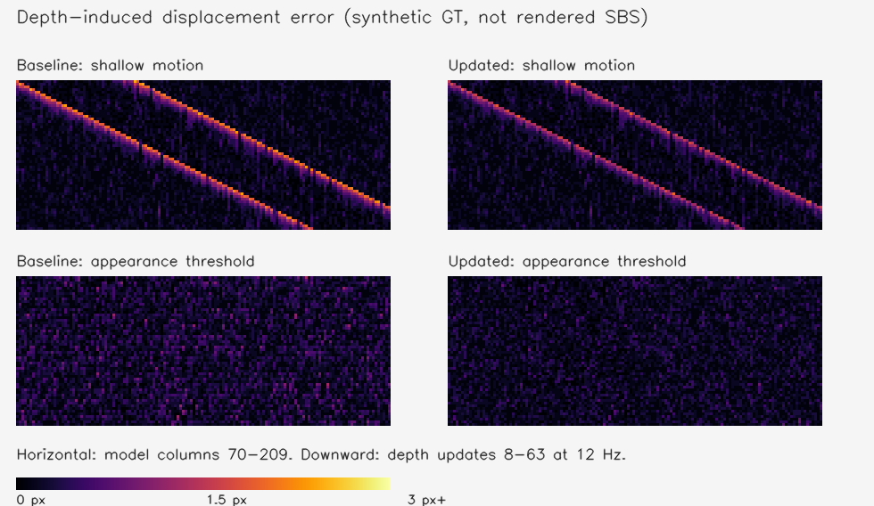

# 2026-09-12 SBS 伪影离线评价

## 结论与采用范围

完成了论文指标调研、优化前协议、实际 Java 稳定器消融、独立随机种子复核、三段真实片源代理评价和测试 APK。产品采用**只平滑外观变化门限**的保守候选，大幅深度变化仍立即拒绝历史。它改善了合成浅轮廓和亮度扰动，但并非对所有运动都更好；下面的压力测试有明确退化。这是待实机 A/B 的开发分支，不是完整 SBS 画质通过结论。

论文与指标定义见[研究](../../archive/2026-09-12-artifact-metrics.md)，选参前约束见[协议](protocol.md)。没有降低视差、改变 266×154 模型分辨率、增加采样率或启动自动平面回退。

## 环境和方法

- 基线 `3560807`；`git show` 提取原 Java 类，与工作区真实 `TemporalDepth` 在同一桌面 JVM 运行，不用 Python 近似生产滤波。
- Apple M4，Microsoft OpenJDK 21.0.6；NumPy 2.4.6、OpenCV 4.11.0、ONNX Runtime 1.29.0。串行执行评价；每个 Java 进程只跑 64 帧，不是充分暖机的性能基准。
- 合成：8 类场景，每类 64 次深度更新、12 Hz、固定每眼 1920 和视差系数 0.016。使用独立真值逆深度，保留 0/1 分位锚点；8 帧之后计算主体指标。新露出掩码统计所有存在露出的相邻帧，不含锚区。
- 开发种子 20260912。初版和第二版候选分别用过不同复核种子，**不再把这些种子冒称最终盲测**。最终候选参数固定后使用 41957、88339；另用 79187 改变运动速度、深度差和颜色差作压力测试。仍是同一合成生成器，不能代表模型的全部真实误差分布。
- 真实片段：既有匿名 clip 0/1/2 的前 96 解码帧，每 2 帧取一次，共 144 次 CPU float 模型推理，约 11.988/11.988/12.5 Hz。模型/片段 SHA-256、版本、可信掩码覆盖率均保存在 JSON；中间图与模型缓存不入 Git。不是手机 U16/I8 QNN 的画质或延迟测量。

## 最终候选与基线

以下为最终两个种子均值，单位均为**单眼位移像素**，不是 RGB 误差，也不是左右眼相对视差；后者误差为两倍。

| 场景 / 指标 | 原版 | 新版 | 变化 |
| --- | ---: | ---: | ---: |
| 移动浅轮廓：新露出区域 MAE | 1.9161 | 1.4415 | −24.8% |
| 移动浅轮廓：轮廓带 MAE | 0.6455 | 0.5091 | −21.1% |
| 移动浅轮廓：时序变化误差 | 0.1551 | 0.1430 | −7.8% |
| 亮度扰动：空间 MAE | 0.2581 | 0.1867 | −27.7% |
| 亮度扰动：时序变化误差 | 0.2536 | 0.1926 | −24.0% |
| 普通静止噪声：MAE | 0.1398 | 0.1398 | 不变 |
| 强轮廓运动：新露出区域 MAE | 0.2979 | 0.2979 | 不变 |
| 同色前后景运动：新露出区域 MAE | 1.9135 | 1.9135 | **未改善** |
| 深度阈值噪声：时序变化误差 | 1.1426 | 1.1426 | **未改善** |
| 真实深度阶跃到 90% | 6 次更新 | 6 次更新 | 未延长响应 |

浅轮廓前景/背景对比度相对真值由 0.9110 到 0.9342，没有用压平画面换取分数。其余普通静止、切镜、强轮廓输出保持基线行为。原始数据：[最终复核](adopted-holdout.json)。



图中横向是模型像素位置，纵向是连续更新；色标统一为 0–3 个单眼像素。它是合成深度误差切片，不是实际眼镜截图。

### 明确退化，不能省略

压力场景：每次更新横移 3 个模型像素，真值深度差 0.13，前后景灰度为 100/107。其外观差 RGB L1=21，原版直接拒绝历史，新版仍部分融合。噪声又让部分深度变化落入 0.12 以内，因而产生额外残留：

- 新露出区域 MAE：**0.2937 → 0.6104 px**（约 +108%，绝对 +0.317 px）。
- 轮廓带 MAE：0.1857 → 0.2769 px。
- 对比度比值：1.0001 → 0.9840；普通强轮廓与同色场景保持基线。

这是平滑外观门限的真实取舍，不是可忽略的统计噪声。保留测试包用于实机判断这种边界退化是否能接受；不可称为全面减少鬼影。解决该歧义需要时间配对、运动/遮挡证据，而非继续盲目调一个阈值。[压力原始数据](adopted-stress.json)。

### 真实片段的代理量

| 片段 | DIS 可信覆盖 | 对齐变化均值，原 → 新 px | P95，原 → 新 px | 深度标准差，原 → 新 |
| --- | ---: | ---: | ---: | ---: |
| 0 | 89.15% | 2.0143 → 2.0083 | 10.6014 → 10.6014 | 0.32779 → 0.32772 |
| 1 | 90.73% | 0.4001 → 0.3949 | 1.2047 → 1.2047 | 0.25087 → 0.25104 |
| 2 | 94.54% | 0.2052 → 0.2003 | 0.5767 → 0.5271 | 0.38102 → 0.38102 |

可信掩码由 RGB 生成，所有候选共用，不随候选输出变化。均值约下降 0.3%/1.3%/2.4%，**不能换算为真实视频鬼影改善百分比**：其中混有真实运动、光流错误和模型尺度变化。没有真实左右眼参考，不能计算可信的 LPIPS、tOF 或 ColorVideoVDP 画质分数。[原始数据](adopted-real-clips.json)。

桌面 Java 的场景中位数约 1.6 ms，小幅正负波动；本轮无新增缓冲或邻域搜索，但不能据此声称手机 CPU 17–20 ms 已降低。手机耗时、功耗与端到端深度年龄均未复测。

## 消融与选择记录

- `SmoothDepth`：颜色/深度同时提前释放历史，合成浅轮廓露出误差一度降到 0.68 px；真实片段均值却增加 6.5%/13.9%/0.3%，未采用。
- `ClipDepth` / `CombinedDepth`：3×3 当前深度范围裁剪历史。桌面多约 0.3 ms，真实代理量退化，未采用。
- `ConservativeDepth`：颜色与深度均用更保守连续门限。亮度扰动改善，但真实片段 1 的 P95 从 1.205 到 1.687 px，快速边缘也退化，未采用。
- `AppearanceDepth`：只平滑外观变化，大深度差保留原拒绝规则。最终产品即此候选；上述压力退化保留，没有再用该压力种子调参。

保留所有输出以防只展示胜出场景：`ablation.json` / `responsive-*.json` 为第一轮，`ablation-followup.json` / `real-ablation.json` / `conservative-*.json` 为第二轮，`appearance-ablation.json` / `appearance-real-ablation.json` 为第三轮开发数据，`adopted-*.json` 为最终产品代码复核。生成候选的代码保存在 `artifact_bench.py`，各 JSON 保存当时生产源码哈希。

## 复现与验证

需要 Git 基线对象、JDK（`java` / `javac` 在 PATH 或设置 `JAVA_HOME`），以及 `StereoLab/experiments/requirements.txt` 的 Python 依赖。以下输出目录应先创建：

```bash
python -m unittest discover -s StereoLab/experiments -p 'test_artifact_metrics.py'
python StereoLab/experiments/artifact_bench.py --prototypes --out /tmp/tachi-ablation.json
python StereoLab/experiments/artifact_bench.py --seeds 41957,88339 --out /tmp/tachi-holdout.json
python StereoLab/experiments/artifact_bench.py --seeds 79187 --motion-speed 3 --shallow-depth .13 --foreground-rgb 107 --out /tmp/tachi-stress.json
python StereoLab/experiments/artifact_real_bench.py --out /tmp/tachi-real.json
python StereoLab/experiments/artifact_figure.py --out /tmp/tachi-errors.png
./scripts/build-android.sh all full
```

真实片段评价额外需要既有 `.local/samples/clip-{0,1,2}.mp4` 及固定 float 模型；缺失时不伪造输入。后续通过缓存复用完全相同的推理输出。

本轮通过：4 项指标正确性测试（包括冻结运动的反例）、150 项 JVM 测试、前端检查与测试、两端产物构建、Android lint、Full Debug/Release 装配和 APK/模型内容验证。新增 JVM 回归覆盖外观门限连续性、大深度变化拒绝、阶跃响应和输出数组所有权。没有操作 ADB，架构中的设备矩阵未宣称通过。

测试包为 `AndroidApp/app/build/distributions/tachi-artifact-eval-20260912-full-debug.apk`（约 101 MiB，附 SHA-256）；没有发布 GitHub Release。需实机同片段 A/B 重点看低对比快移、同色轮廓、细线、横移/推拉/切镜，同时导出阶段耗时和有效播放区间的深度年龄。后续首要项仍是实际视频时间与深度配对、运动重投影与遮挡露出处理。
