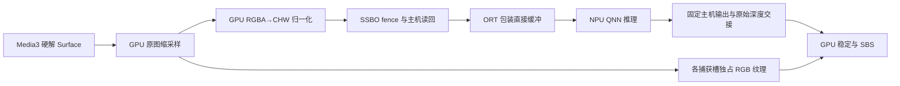

# 2026-09-13 GPU 输入、双捕获缓冲与 QNN 共享内存实验

代码基线 `1d73a87`。沿用 SM8850 / V81、固定量化模型与原 GPU 稳定算法。所有新开关默认关闭，捕获默认仍是单槽、12 Hz。本轮改动进入共享 `native-video` 实验路径；独立 lab 验证不能代替正式 tachi 外接眼镜/字幕回归。

## 已实现的处理路径



- GPU compute 通过一次初始化的 768 项 float 查表执行 ImageNet mean/std 归一化与通道重排，保留 top-row-first、RGB 顺序和 float CHW 模型契约。默认 CPU 路径可用于对照。GPU 路径不再执行 CPU 像素归一化循环；lab 的 RGBA 颜色探针在该路径关闭，避免将 CHW 当作 RGBA。
- 一次只有一个取帧 GPU fence；最多两个捕获 lease，各自拥有独立 RGB 纹理和直接主机缓冲。第一个在 NPU 运算时，第二个可捕获/准备或等待串行 worker。没有并发调用同一 ORT session，也没有无限 FIFO。
- RGB 纹理直到对应原始深度提交 GPU 私有快照才释放；主机缓冲在推理结束前不复用。GPU 稳定最多一个在途 job，待交接 raw 队列最多两个。旧 lease 的重复释放不会释放已复用槽。seek/source/context generation 仍隔离旧结果；正常慢帧继续保持有效深度，不自动压平。
- 新增固定输出 `OnnxTensor`，复用直接 FloatBuffer，避开 ORT 1.22 `getFloatBuffer()` 的逐次堆缓冲分配/复制。**这只是 pinned host output，不是 QNN 注册内存。** 原始 float 数组交接和 SSBO 上传仍然存在。
- 可独立开启取帧 fence 的异步观察，复用同一个有界 GL observer，不再为观察取帧完成反复提交完整 SBS。2 ms 是请求观察间隔；同 GL 线程的 swap/驱动排队仍会推迟执行。
- 可独立指定 12 或 24 Hz 目标；这是静态实验选项，不是已经完成自适应资源调度。采样仍受 fresh video frame、cadence 和空闲 lease 限制。

实验参数：

```bash
AndroidApp/gradlew -p AndroidApp -PnativeQnn=true -PdepthResolution=392 \
  -PgpuDepthStabilization=true -PgpuPreprocess=true -PcaptureSlots=2 \
  -PpinnedDepthOutput=true -PasyncCapturePoll=true -PdepthHz=24 \
  -PlabPerformanceBuild=true :native-player-lab:assembleDebug
```

`gpuPreprocess` 要求 QNN 与 GPU 稳定同时开启；captureSlots 只接受 1/2，depthHz 只接受 12/24。正式 Full 实验构建还需 `-PrealtimeSbs=true`；不修改现有发布默认值或升级身份。

## 测量方法与局限

同一授权 Jellyfin 动画本地副本、1080p H.264/AAC 23.976 fps、约 120 秒。非调试 lab、ART speed，双眼 1920×1080 FBO 后缩小到手机，深度窗开启。每个连续播放独立进程，剔除 ready+valid 初始 15 秒计算更新率。阶段均值取末尾最多 512 个样本，不平均重叠窗口；墙钟 depth age 不是媒体 PTS 错位或光学延迟。trace 去掉颜色探针，不含媒体 URL/身份/图像。

CPU `preprocessMs` 在 GPU 模式下仅含 ORT 张量包装，不含 GPU 工作；必须同时看取帧 submit、fenceObserved、mapCopy 和 captureToUpload。GPU 路径读回 **12 字节/像素**，CPU 输入路径读回 4 字节/像素：算术迁移不等于带宽下降。392 输入一次约 1.05 MB，518 约 1.83 MB（十进制）。

GPU timer query 偶见单次异常大值使均值显著高于 P95；本轮不据此下 GPU 算术耗时结论。主机阶段与 fence 完成观察用于管线分析。运行顺序未随机化，无长时热态、功耗或完整呈现帧轨迹，吞吐不等于视频帧率。

| 配置 | CPU 输入准备 ms | 推理阶段 ms | 深度 Hz | 捕获→完成观察均值 ms |
| --- | ---: | ---: | ---: | ---: |
| 518，CPU 输入，双槽，12 Hz 目标 | 3.0067 | 56.5559 | 11.98 | 95.58 |
| 518，初版 GPU 输入，双槽，12 Hz 目标 | 0.0581 | 56.7926 | 12.00 | 91.24 |
| 392，初版 GPU 输入，单槽，24 Hz 目标 | 0.0520 | 32.8599 | 12.27 | 60.63 |
| 392，初版 GPU 输入，双槽，24 Hz 目标 | 0.0460 | 32.6756 | 19.08 | 59.16 |
| **392，最终精确查表 GPU 输入，双槽，24 Hz 目标** | **0.0451** | **32.5710** | **19.91** | **59.97** |

表内均开启固定输出与异步捕获观察，GPU 稳定保持相同。初版/最终版的区别见下方数值检查；不能把查表前后的细小吞吐差解释为单独算法收益。

- 同轮初版 GPU 输入单槽→双槽对照，392 深度吞吐提高约 **55.5%**，主要收益是重叠，单次捕获延迟没有同比下降。
- 同轮 518 CPU/GPU 输入对照，CPU 准备工作减少约 **98%**，但两者都触及 12 Hz 目标；GPU 输入不是本轮吞吐增长的主要原因。CPU 输入 readPixels 的 submit 均值约 21.24 ms、后续 fence 约 1.54 ms；GPU 输入对应约 0.47 / 21.78 ms，等待转移到了后面，不能只拿 submit 列宣称消除了 20 ms。
- 前轮单槽 518 GPU 稳定路径约 8.79 Hz，本轮双槽达到 12 Hz；这还同时改变了输入、固定输出与观察机制，且属跨轮参考，不是单变量对照。
- 最终 392 的队列等待很小，但取帧 fence 观察仍约 17.25 ms，加上约 32.57 ms 推理及后处理，captureToUpload 约 60 ms；已有流水线把吞吐提升到约 20 Hz，仍不能承诺 24 Hz。

六份 trace/summary 保留各自参数与时序。`gpu2-pinned392` 是最初 12 Hz / vsync 捕获观察参考，其余使用 asyncCapturePoll；`lut2-pinned392-24` 才是最终精确查表版本。全部沿用相同模型 hash，不修改视差/滤波参数。


实际 `inferenceMs` 包含同步 ORT/QNN 调用与取出原始 float 输出，不是 NPU 硬件计数器的纯核心时间。采样增加也会增加总工作量，不能把 CPU 单次耗时降低等同于整机功耗降低。

## 数值与生命周期验证

合成纹理覆盖行、列、RGB 通道顺序与全部 0–255 色值；GPU CHW 与 CPU 公式逐值比较。最终查表版在 392×224 的 263,424 个通道值上与 CPU 参考误差为 **0**；同一合成输入的 CPU 重复推理、CPU/GPU 输入推理的原始深度最大差异与 RMSE 均为 **0**，见 [numerical-checks.json](numerical-checks.json)。这是该用例的结果，不是任意网络/驱动的普遍位一致证明。

初版直接使用 GPU 除法/减法，CHW 最大误差虽只有 7.1525574e-7，量化深度输出最大差异却为 0.04309511、RMSE 0.0171576。因此最终采用只在初始化计算一次的查表常量，消除逐帧浮点重排差异。性能对照中保留初版结果并明确标记；最终代码不再使用该算术版本。深度稳定同时重测 80 帧/6,849,024 像素，最大 R8 差 1，40 次原 RGB 覆盖配对检查通过，没有新增时域平滑或光流算法。

最终 392 双槽/24 Hz lab 通过慢推理 250 ms 保持深度、暂停停止上传、seek 恢复并丢弃旧结果、lab 2D/SBS 切换、404 换源清除旧图并恢复，以及前后台重建后重新打开恢复，见 [lifecycle.json](lifecycle.json)。设备最后停在有效 GPU 深度的暂停 SBS 画面。lab 几何切换不是眼镜 USB 模式切换。

构建验证包括 152 项 JVM 测试（17 native-video + 135 app）、三个模块 lint、GPU Full Debug APK、默认 CPU/Lite APK 及两种包的 `scripts/verify-android.sh`。实验 APK 的模型和九个厂商库按既有清单校验，见 [apk-verification.json](apk-verification.json)。正式产品 GPU APK只构建，不覆盖安装主应用；外接眼镜、音轨/字幕/多编解码格式与完整产品矩阵仍待验收。

## 原生共享内存验证范围

独立 `StereoLab/npu-benchmark` 用显式 `--es benchmark_stage shared` 扩展原有原生 QNN ReLU 探针，读取与部署 runtime 匹配的本地官方 SDK 头文件，不向仓库加入 SDK。与 ONNX Java 路径独立。

实机通过两层验证，记录见 [shared-memory.json](shared-memory.json)：

1. `rpcmem_alloc` → fd → `QnnMem_register` → `QNN_TENSORMEMTYPE_MEMHANDLE` → graphExecute → 注销/释放。100 次变化输入的量化 ReLU 输出全部正确。
2. `AHardwareBuffer` BLOB → GLES `GL_EXT_external_buffer` SSBO，与 HTP custom shared-buffer descriptor 注册同一数据 fd。GPU compute 生成输入，QNN HTP 运算，GPU compute 检查输出。100 次变化输入全部通过，每轮主机只读 4-byte 校验值，没有输入/输出图像主机复制。

该设备 BLOB 导出两个 fd（包含附加资源）。实验没有假定“第一个 fd 就是数据”，而是通过公开 AHardwareBuffer lock 初始化自有缓冲，再只读映射比对内容，要求唯一匹配后才注册。此方法只证明本机分配的线性 BLOB 可互通，**不是对所有厂商 gralloc 布局的兼容承诺**。

最初使用通用 `QNN_MEM_TYPE_DMA_BUF` 的尝试在 HTP `memRegister` 内崩溃，符号化定位到调用点；最终改为官方 `QnnHtpMem.h` 的 `QNN_HTP_MEM_SHARED_BUFFER` custom descriptor 后通过。失败路径没有留作运行时自动回退。

图只有 16 个 uint8 元素，不是 Depth Anything；测试使用 `glFinish` 和同步 graphExecute 明确先后关系，不是生产异步 fence 实现。尚未验证大张量、多槽交错、完整深度图、性能、长时功耗。实际播放器仍走 ORT Java 主机交换，这次不能称为完整实时 SBS 零拷贝。


## 端到端优化优先级

1. **消除 GPU/NPU 之间的主机往返**。先验证原生分配/注册/注销、重复输入可见性，再验证 GPU 生产输入→HTP 执行→GPU 读取输出。实际深度模型还需要匹配图的张量布局、数据类型、量化参数、外部内存导入和 fence/cache 生命周期；不能把 16 元素 ReLU 的通过等同于完整 Depth Anything 图通过。ORT 提供 HTP shared-memory allocator 与原生 I/O binding，可与直接 QNN context 方案对照；仅添加 provider option 或 Java direct buffer 都不够。
2. **将离屏计算从呈现线程分离**。本轮取帧 fence 观察仍在约十几至二十几 ms 范围，2 ms observer 无法绕过 swap 阻塞。可验证共享 EGL context 的专用离屏计算线程，并以原生 fence 同步纹理；不要通过 `glFinish` 串行化正常播放器。分离后必须重新验证资源归属与 Surface 重建。
3. **按视频时间对齐深度和画面**。绑定 decoder 的 media PTS、捕获时间、推理完成、应用深度时的显示 PTS；先量化深度错位。低延迟方案是光流/运动重投影与遮挡拒绝；另一方案是保留少量视频帧，等对应深度再显示，同时协调音频/字幕。下载预缓冲只能缓解网络；真正提前推理需要提前解码并持有对应图像，增加内存和播放延迟。
4. **分辨率、更新率与 NPU 预算联合控制**。518 推理约 57 ms，单串行 NPU 即使没有其他成本也只有约 17.5 Hz；24 Hz 的预算是 41.7 ms，无法靠双缓冲消除模型本身的下限。392 约 33 ms 有理论空间，但需要把取帧/提交/呈现等待压下去。自适应策略应带迟滞，优先保持几何参数和有效深度，避免反复切分辨率/强度制造新的视觉跳动。
5. **融合与精度选择**。在支持的图/共享布局中融合 resize、归一化、量化，或由 GPU 直接产出量化 NHWC，减少 12-byte float 中间结果；必须以真实模型重新验证量化尺度和精度，不能仅改变输入类型。非充电长时测试后再评价 NPU 性能档位，避免只靠高频掩盖内存等待。

参考：[ORT QNN EP](https://onnxruntime.ai/docs/execution-providers/QNN-ExecutionProvider.html)、[ORT I/O Binding](https://onnxruntime.ai/docs/performance/tune-performance/iobinding.html)、[Android AHardwareBuffer](https://developer.android.com/ndk/reference/group/a-hardware-buffer)、本地官方 QAIRT `QnnMem.h` / `HTP/QnnHtpMem.h` 与 `SampleAppSharedBuffer` 示例。当前网页可能覆盖比本项目 ORT 1.22 更新的版本，实施前需核对实际 ABI/选项。
