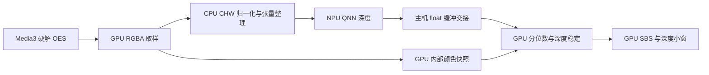

# 2026-09-13 GPU 深度稳定与实机管线验证

算法基线 `044712a`，设备沿用 SM8850 / V81。**CPU 深度稳定可以移到 GPU，已通过数值检查并接入共享原生 QNN/SBS 实验管线。** 默认构建仍使用 CPU 对照；通过 `-PgpuDepthStabilization=true` 显式开启，尚未作为产品默认发布。

## 移动了什么

原来的 `TemporalDepth` 包含排序求 P5/P95、全图颜色差/切镜判定、分位范围 EMA、归一化、像素外观门控、深度历史融合和 8-bit 输出。GPU 版本把这些工作全部移到 GLES compute，CPU 后处理阶段只保留原始 float 深度的所有权交接。



这不是零拷贝：仍有 RGBA/PBO 读回、CPU CHW 准备、ORT Java 输出读取、raw 数组交接及 GPU SSBO 上传。GPU 稳定后的图像不再读回 CPU，也不再由 CPU 生成 R8 数组再上传。

## 算法与配对约束

- float 位模式转换为有序整数，四轮 8-bit radix histogram/select 精确选取 `N/20` 与 `19N/20` 的元素。这里的直方图用于逐字节选择精确数值，**不是把深度范围粗分 256 桶来近似分位数**。负值、正值与重复元素均被测试。
- GPU 保留原来的范围权重 0.15、像素权重 0.35–1、颜色差门控 6–42、深度差 0.12 拒绝条件及切镜阈值。float 历史留在 SSBO；显示纹理采用 compute 可写的 RGBA8，红通道与原 R8 相同地量化至 0–255，再按原采样方式用于 gather33。没有增加模糊、光流、自动压平或新的视差强度。
- 每次原始深度保留其捕获 lease，直到对应 RGBA 纹理在 GPU 内完成**快照命令提交**。快照是 GPU 内部复制，随后新捕获可以复用原纹理。GPU job 完成前不会复用快照，因此不会以最新 RGB 稳定旧深度。
- GPU 与下一次捕获/NPU 可以重叠；最多一个在途 GPU job、一个待交接 raw 结果，捕获仍受原单 lease 限制。没有无界帧队列，也尚未把捕获与 NPU 本身改为完整多缓冲流水线。
- CPU 非阻塞检查 fence，只读取 44 字节控制数据；完成观察与视频刷新分离，轮询不会反复绘制完整 SBS。它仍运行在同一 GL 线程，`eglSwapBuffers`/驱动队列可能推迟观察，因此请求 2 ms 后检查不保证 2 ms 内完成。
- seek、换源、Surface 重建按 generation 丢弃旧结果并重置 GPU 历史。正常慢帧/平坦输出保持最后有效图；非有限输入进入与 CPU 一致的 depth error 路径并保持有效图，不回退 CPU 推理或自动压平。

实现要求 GLES 3.1、至少 256 个工作组线程；目前只在该 Adreno 设备验证。计算着色器及 Java 管理类位于 `native-video`，由产品和独立 lab 共用。

## 数值检查

独立 `GpuDepthBenchmarkActivity` 使用真实 Java `TemporalDepth` 作为参考，在手机 GPU 上执行同一套着色器。每种尺寸 80 帧，覆盖正负深度、分位边界/极端离群值、轻微扰动、移动轮廓、颜色切换、历史重置、NaN/Infinity 和平坦帧。

每轮有 40 次在提交后、完成前主动覆盖原 RGB 纹理，验证 GPU 快照确实隔离后续捕获。诊断活动才会完整读回输出图像；正常播放器只读控制数据。

| 尺寸 | 对照像素数 | 拒绝帧 | 源纹理覆盖测试 | 最大 8-bit 误差 | 平均 8-bit 误差 |
| --- | ---: | ---: | ---: | ---: | ---: |
| 392×224 | 6,849,024 | 6 | 40 | 1 | 0.00000146 |
| 518×294 | 11,878,776 | 6 | 40 | 1 | 0.00000227 |

所有接受/拒绝判断一致，平坦和非有限帧不改变已有输出。测试还检查非有限输入与 Java 异常的分类一致。差异来自浮点实现/量化边界，未观察到超过 1 灰度级的差异；不是证明任意输入永远位一致，也不能替代真实片源边缘画质 A/B。现有同坐标历史、无运动重投影和遮挡缺口问题仍然存在。

原始数字见 [synthetic-checks.json](synthetic-checks.json)。合成序列的排序结构与真实模型输出不同，不能用其 CPU 耗时替代真实播放测量。GPU timer query 也不包含所有主机提交/观察成本，本轮不以极小的 compute query 数字宣称整段后处理“免费”。

## 真实片源对照

同一已有 Jellyfin 动画本地副本，1080p H.264/AAC、23.976 fps，约 120 秒，通过本地 HTTP + ADB reverse 播放。两眼实际 1920×1080 FBO 后缩小到手机，深度小窗开启。所有下表测试均为非调试 lab、确认 ART `speed`、纯 QNN HTP、12 Hz 捕获目标；没有修改模型、量化、滤波参数或合成强度。未安装替换正式 tachi 应用。

去掉 playing + ready + valid 初始 15 秒，以上传计数增量/实际时间计算更新率。ms 是最后一个最多 512 样本滚动窗口，不平均重叠窗口。原始 trace 已删除 RGB 探针，不含源 URL、身份或图像。

| 配置 | NPU 均值 ms | CPU 后处理/交接均值 ms | 深度 Hz | 取帧→提交/确认均值 ms | 去预热后区间 s |
| --- | ---: | ---: | ---: | ---: | ---: |
| 518 CPU 对照 | 57.17 | 20.87 | 7.78 | 110.96 | 102.81 |
| 518 GPU，等待刷新确认 | 57.20 | 0.39 | 8.06 | 105.48 | 103.89 |
| **518 GPU，快照与重叠** | **56.87** | **0.39** | **8.79** | **101.44** | **103.99** |
| **392 GPU，快照与重叠** | **32.77** | **0.27** | **11.97** | **68.74** | **104.11** |

518 同轮 CPU/GPU 对照，CPU 后处理工作减少约 98%，深度更新率提高约 13%。GPU 提交的 CPU 墙钟均值约 0.85 ms，完整完成观察均值仍约 14.74 ms；392 对应阶段更短。只搬算术不足以消除 GL 线程、呈现队列与取帧等待。

**时间口径有区别**：CPU 的取帧→上传截至纹理上传提交；GPU 版本截至 fence 完成被观察到，包括调度等待。二者都不是光学端到端延迟，也不是媒体 PTS 偏差，不能把该列百分比直接解释成观看延迟改善。深度 Hz 不是视频帧率；未记录全程解码/呈现帧轨迹，不宣称零掉帧。GPU 工作与 CPU/NPU 重叠，各阶段不能直接相加。

392 最初串行 GPU 试验为 11.41 Hz，快照/调度版本为 11.97 Hz；更早的 CPU 392 参考为 11.26 Hz，见[前轮分辨率扫描](../2026-09-13-resolution-sweep/README.md)。392 CPU 数字来自前轮，不与本轮 518 同轮对照混称一次严格交叉实验。运行顺序未随机化、没有功耗测量或长时热态验收，电池温度也不能代表芯片温度。

## 保留下来的 CPU 工作与下一步

1. **RGBA→CHW/归一化**：本轮约 2–3.4 ms，可继续评估 GPU 执行或合入模型输入计算。要同时比较读回体积；直接把 4-byte RGBA 改为 12-byte float CHW 再读回，未必缩短整条管线。
2. **ORT Java 主机缓冲交换**：需要验证原生 QNN 注册内存、GPU 可共享缓冲、布局和 cache/fence 协议后才可消除，不能因为 SoC 共享物理内存就称当前代码已零拷贝。
3. **捕获与 NPU 的串行占用**：GPU 后处理已与后续工作重叠，但当前仍不是双捕获缓冲。继续提升吞吐应验证有界多缓冲、时间戳配对和源/seek 代次保护。

GPU 迁移解决计算归属和一部分 CPU 开销，不会自动修复模型深度抖动。画质优化仍需独立对照。

## 构建、验证和范围

```bash
# 独立实验包；默认 GPU 开关为 false。
AndroidApp/gradlew -p AndroidApp -PnativeQnn=true -PdepthResolution=392 \
  -PlabPerformanceBuild=true -PgpuDepthStabilization=true \
  :native-player-lab:assembleDebug
# 完整播放器实验包，沿用既有签名/应用 ID；本轮只构建，未覆盖用户正式应用。
AndroidApp/gradlew -p AndroidApp -PrealtimeSbs=true -PdepthResolution=392 \
  -PgpuDepthStabilization=true :app:assembleDebug
# 数值检查，仅用于独立 lab。
adb shell am start -W -n com.jellyfinforrayneo.nativelab/.GpuDepthBenchmarkActivity
adb logcat -d -s GpuDepthBenchmark:I
```

模型/九个厂商库继续按固定清单校验，GPU 实验没有加入新的模型或 SDK。完整播放器的 GPU 开关、compute query、完成观察耗时进入数字白名单诊断；`gpuStabilization=true` 时 `stabilizeMs` 仅是 CPU raw 交接，实际完成观察看 `gpuStabilizeCompletionMeanMs/P95Ms`。

通过两种尺寸的数值检查和真实播放；392 的慢帧保持、暂停计数停止、seek 后新深度恢复、在途旧结果丢弃一次、lab 2D/SBS 切换、404 换源清除旧图并恢复、前后台重建后重新打开视频恢复，见 [lifecycle.json](lifecycle.json)。lab 切换不是眼镜 USB 模式切换。

构建检查包括两端前端构建、GlassesUI TypeScript 检查、原生/应用 150 项 JVM 测试、lint、GPU Full Debug APK 及 `scripts/verify-android.sh`。默认 CPU/Lite 构建也保留验证。正式产品会话、外接眼镜、字幕并发、其他 GPU 和长时功耗尚未完成完整设备矩阵；默认保持 CPU 路径，没有发布 Release。

实验 APK 的 SHA-256、模型与厂商库校验记录见 [apk-verification.json](apk-verification.json)。完整产品 GPU Debug APK 已构建并验证签名，但未安装进行产品实机回归；上述性能来自独立非调试 lab。
